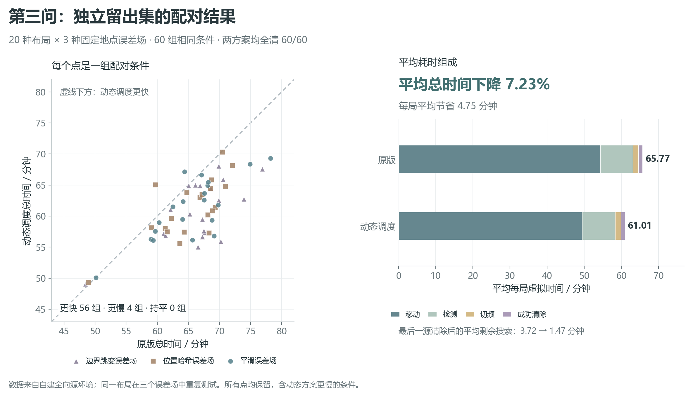
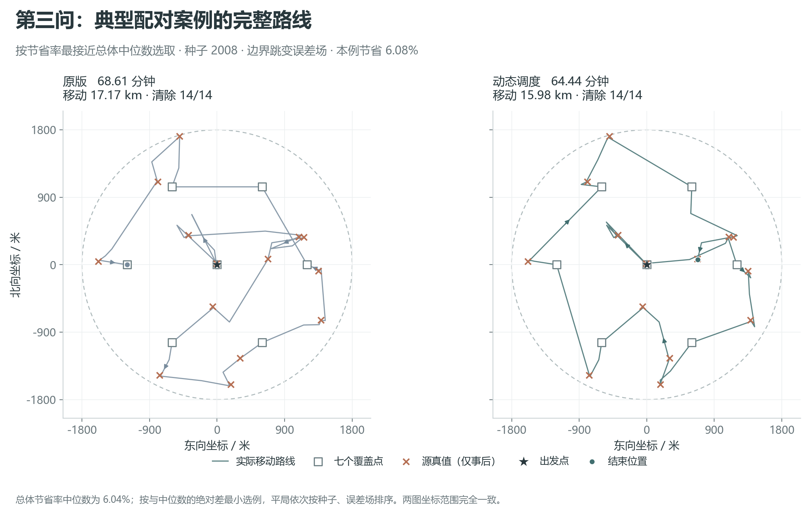

# 第三问改进方案与本地实验结果

本轮实现了定位异常的有限光学后备方法，以及对已发现目标和剩余扫描点的动态访问调度。在20种新布局、3种固定地点误差场形成的60组留出条件中，原版和改进版均全部清除；改进版平均总任务时间减少7.23%，平均少走1469.19米。56组更快，4组更慢，最差增加318.14秒。

这些是本地自建场景的配对结果。本轮未连接官方模拟器，未启动官方演练或正式测试。用户已有practice-02官方演练记录没有用于生成源真值、调整本地场景或替代同场景对照。

## 已实现的变化

### 原版、后备处理与动态调度

`baseline` 调用未改动的原求解器，采用time单源选点及immediate调度。`safe` 只增加局部恢复。`dynamic` 将当前已发现源和剩余七点扫描任务一起安排路径。三种版本都保留原单源的误差楔形、保守多边形、可靠接收检验和20米清除判据。

对已发现源，使用当前首测候选区域的最小包围圆圆心作为访问代理；对扫描任务，使用实际扫描点。由最多三个初始节点生成最近邻路径，再通过最多20轮开放路径2-opt改进访问顺序。路线不要求回到原点。每执行一个完整扫描任务或一个单源定位清除任务后，用实际位置与新反馈重新规划。

路线评分只比较当前代理节点的行走距离。代理中心不是源真值，评分也没有完整预测未来未知源及全部局部测量成本。因此该方法是滚动启发式，不是全局最优路线证明。本轮没有增加跨频道共享观测，也没有额外修改单源time选点公式。

### 有限光学后备方法

设首测位置为S、读数方向为u、垂直方向为v。正常direction响应在题设下将真实源限制为G=S+xu+yv，其中0≤x≤1500，且|y|≤1500sin(1°)<26.18米。

采用q=S+20iu±15v，i=0,…,75，共152个清除点。任意可能源到最近网格点的前向差≤10米、横向差≤15米，所以距离≤√325≈18.0278米，小于20米。逐点尝试指定频道的光学清除，成功后停止；清除不需要切频道。

两行蛇形路线内部长度3030米。最坏情况下151次失败、最后一次成功，从首个网格点起虚拟耗时不超过3030/5+151×3+5=1064秒，另加从当前位置到首个网格点的移动时间。程序在四种蛇形朝向中选择最近起点。

达到30步上限、候选点计算失败、可行域矛盾或应当成功的清除失败时，转入以原始首测为依据的覆盖搜索，不依赖可能已经损坏的后续多边形。若152个点仍全部失败，明确返回模型不一致，不能记作完成。接口超时、拒绝请求和传输异常正常抛出，不被误当作清除失败。

这是对有效首测下局部有限动作的保证。现实程序时间仍受计算、通信和整局其他目标影响，不能由1064秒虚拟时间直接判断现实20分钟预算。

在精确几何、真实源始终保留在候选集中、合法接口动作都被执行，并采用默认30步及当前152点配置的条件下，还可给出整局保守虚拟时间上界。每个单源任务开始前，机器狗刚完成扫描或成功清除，其位置范数≤1820米，距当前源≤3620米。正常测向点距源≤1500米，因此首段移动≤5120米，后续最多29段每段≤3000米。

普通可靠清除点距源≤20米，接近路程≤3640米。光学后备首个网格点距源≤√(1500²+(1500sin1°+15)²)<1501米，接近路程≤5121米。因此给终结阶段统一预留5121米接近路程、3030米网格路程、458秒网格动作，以及额外5秒普通清除，是同时涵盖两种结束方式的保守预算。

每源虚拟时间≤(5120+29×3000+5121+3030)/5+30×6+152×3+2+5=20697.2秒。全局扫描至多七站，每次接近≤3020米，至多140次检测各按6秒计，扫描预算≤5068秒。至多16个源，所以整局≤16×20697.2+5068=336223.2秒≈93.40小时，小于题设100小时。这是极保守上界，不是预计用时，也不覆盖数值失真、接口异常或现实20分钟截止；现实计算时间仍须另行验证。

### 可复核的完成证书

求解器包装器只记录已接受的measure/clear反馈。完成必须满足以下之一：成功清除16个不同频道；或20个频道均已成功清除，或者作为未发现频道在七个覆盖点全部得到无信号。收到过正反馈但尚未清除的频道不能被排除。

七点仍为原点与半径1200米正六边形六顶点。目标半径≤1000米时由原点覆盖；其余源与最近环点夹角≤30°。距离平方关于源径向距离为凸函数，检查1000和1800两个端点，环带最坏距离为968.901572米，小于最小接收半径1000米。动态访问顺序不改变这一证明。

## 配对实验设计

开发集：种子1000—1009，10种布局×3种误差场=30个条件；三版本共90次运行。开发集动态调度平均总时间降低12.48%。开发集之后补了代理中心数值异常时的恢复分支，没有修改路线策略；受影响分支由故障注入独立验证。

留出集：策略冻结后，种子2000—2019，20种新布局×3种误差场=60个条件；三版本共180次运行。每个版本对应786个源实例，含重复布局在三种误差场下的实例，不能称为786个独立随机布局。留出结果产生后没有按其结果调参。

源数量在10—16之间，频道不重复；位置按圆域面积均匀生成，接收半径在1000—1500米均匀生成。误差场为smooth、hash和extreme，在同一位置固定。生成器与原版相同；误差幅度使用0.99°后保留两位小数。这些分布均为自建测试条件，不是题目声明的官方分布。

每个配对条件的三个版本使用完全相同的源真值、随机种子和固定误差场。真值只由环境生成与事后评估读取。测试逐次保留结果、原始动作、定位区域和完成证书；运行前后核心代码SHA-256一致性检查为True。

## 留出集主要结果

| 指标 | 原版 baseline | 动态调度 dynamic |
|---|---:|---:|
| 全部清除的条件数 | 60/60 | 60/60 |
| 被清除源实例比例 | 786/786 | 786/786 |
| 清除失败次数 | 0 | 0 |
| 每局平均总时间 / 秒 | 3945.95 | 3660.73 |
| 每局时间中位数 / 秒 | 4028.49 | 3671.87 |
| 每局时间90%分位 / 秒 | 4238.63 | 4032.41 |
| 最慢案例总时间 / 秒 | 4692.46 | 4218.38 |
| 逐局平均每源时间 / 秒 | 305.31 | 282.78 |
| 每局平均移动距离 / 米 | 16313.18 | 14843.99 |
| 每局平均检测次数 | 105.48 | 106.80 |
| 每局平均切频次数 | 90.40 | 92.43 |
| 最后清除后平均查漏时间 / 秒 | 223.13 | 88.22 |

`safe` 在全部60个留出条件中与原版逐条动作和虚拟时间完全一致；普通条件没有触发后备方法。因此这批数据中的性能差异来自动态访问调度，后备分支的效果由专门的强制恢复检查验证。

平均总时间减少285.22秒，即两版本平均总时间之差除以原版平均值为7.23%。若先计算每个配对条件的改善比例再求平均，则为6.97%，二者口径不同。

每局平均移动时间减少293.84秒，检测时间增加6.58秒，切频时间增加2.03秒，清除时间相同。平均总时间差等于上述分项相抵后的285.22秒。逐局平均每源时间是各局T/清除数的算术平均，不与全部时间相加再除以全部清除数混用。

路线图采用改善比例最接近总体中位数的案例，选择依据保存在figures/figure_metadata.json。图中真实源位置只用于事后解释。

## 保留的变慢案例

| 种子 | 误差场 | 原版 / 秒 | 动态 / 秒 | 增加 / 秒 | 增幅 |
|---|---|---:|---:|---:|---:|
| 2004 | hash | 3583.36 | 3901.50 | 318.14 | 8.88% |
| 2006 | hash | 2933.78 | 2957.01 | 23.23 | 0.79% |
| 2006 | extreme | 2907.36 | 2943.35 | 35.99 | 1.24% |
| 2010 | smooth | 3862.29 | 4030.05 | 167.76 | 4.34% |

2004/hash是本批最大退化，额外约299.14秒来自移动，15秒来自检测，4秒来自切频。由此可以确认当前代理路线有时会使实际行走更长；原因是否主要来自首测距离不确定性，需要再做专门对照，不能直接由这一个案例断言。另一个独立压力案例near混合布局也从3424.54秒升至3532.20秒，说明不能声称逐例优于原版。

## 可靠性与接口检查

- 15/15主压力检查通过：三种调度×五个布局，涵盖10源原点、near边界混合、16源最难边界重合、16源最小半径边界环，以及最后一个扫描点才能发现的边界源，共186个源全部清除。
- 独立复算1619个动作的累计时间；核查388个定位多边形，没有排除真实源。策略通过仅暴露操作方法和位置/频道的接口代理运行，不能读取环境真值。
- 15/15故障注入检查通过，包括代理点几何异常的恢复、光学后备、检测/清除接口异常及拒绝请求传播、无效步数参数在动作前拒绝。
- 72个合法极端首测场景强制启用光学覆盖，全部清除；48个正常单源场景与原版的动作、定位记录及计时完全一致。
- 本地通信检查12/12通过（passed=True），包括三版本真实求解器经过临时HTTP替身端到端清除、丢失响应后同ID重试、拒绝请求不更新状态、按剩余预算缩短等待、异常保留、未测频道不能伪造覆盖证书。服务只在临时回环端口模拟协议，不能代表已接入官方模拟器。首轮检查因测试临时目录权限阻断，原始记录保存在http-validation-initial.json；解决运行权限后，当前完整检查通过。

最大本地策略用时：留出集中原版1.070秒，动态版1.242秒。此计时包含策略和进程内环境动作，不含导入、事后审计和结果落盘，也不含真实HTTP；不是题目正式测试的程序运行时间。

## 当前结论与下一步实验

已经得到一个在这批新本地条件上平均更快的第三问版本，并补上可独立验证的局部光学后备方法。保留原版、safe和dynamic三个开关，可以继续做同场景对照。

后续本地研究应优先解释四个退化案例，再比较“只用中心代理”和“考虑候选区域不确定性与局部定位成本”的访问顺序评分。若进一步增加路过点对多个频道的测向，应单独设实验组，将新增5秒检测与切频成本一起计入。

现有60/60经验成功不等于对所有未知环境的概率保证。第四问定向盲区没有实现；本轮未验证官方环境性能，也未消耗任何官方测试机会。

详细运行方式和文件对应见[README](README.md)。
