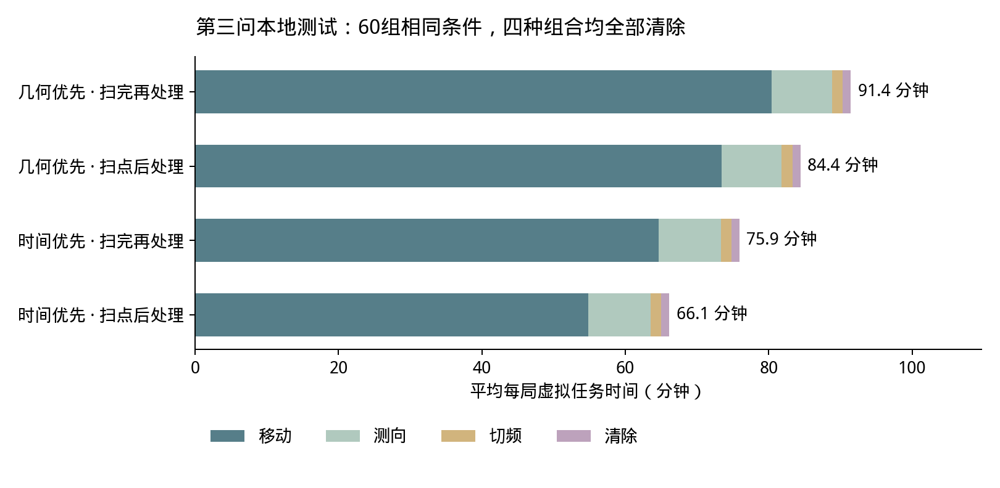
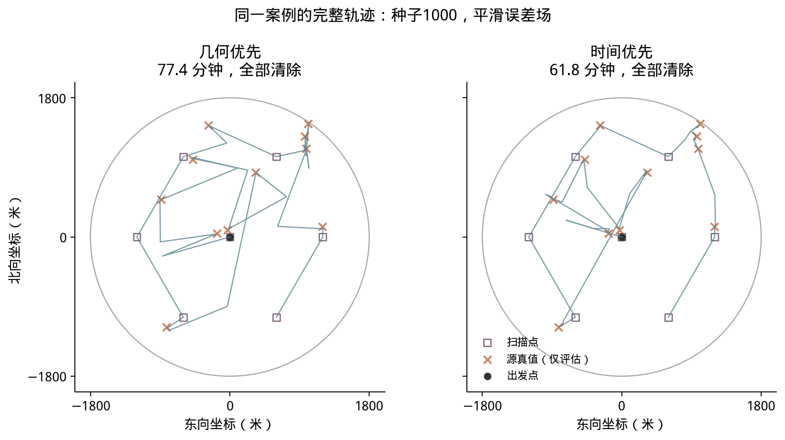

# B题闭环原型本地测试结果

本轮完成了单源闭环、第三问多源完整搜索清除及HTTP适配器的本地替身验证。未运行官方模拟器；所有虚拟时间均由自建环境计算。

## 比较设计

- 单源：40种随机布局 × 3种固定地点误差场 = 120组条件，两种策略各运行一次，共240次。源初始可检测；距离在6米至该源接收半径之间取样。
- 多源：独立的20种布局（种子1000—1019）× 3种误差场 = 60组条件，四种组合各运行一次，共240次。每局10—16个源，布局按目标圆盘面积均匀生成；接收半径在1000—1500米内均匀生成。
- 三种误差场为平滑空间变化、位置哈希及接近误差界的正负跳变；均在同一地点保持固定。它们仅为压力测试条件，不代表官方分布。
- 两种选点策略共享候选点、位置集合、接收保证、清除判据和最多30次局部迭代限制。全部失败记录均保留；均值没有排除困难案例。

## 单源结果

| 选点策略 | 成功条件数 | 平均总时间/秒 | 平均测向次数 | 平均本地计算时间/秒 |
|---|---:|---:|---:|---:|
| geometry | 120/120 | 316.60 | 2.47 | 0.0156 |
| time | 120/120 | 234.79 | 3.14 | 0.0580 |

时间优先的平均任务时间减少 25.84%。它增加少量测向，换取更短的移动路径。

## 第三问结果

| 选点 | 调度 | 全部清除 | 每局平均总时间/秒 | 每源平均时间/秒 | 单局本地计算最大值/秒 |
|---|---|---:|---:|---:|---:|
| geometry | immediate | 60/60 | 5063.99 | 381.20 | 0.357 |
| geometry | deferred | 60/60 | 5484.36 | 413.63 | 0.425 |
| time | immediate | 60/60 | 3968.54 | 299.92 | 1.064 |
| time | deferred | 60/60 | 4553.97 | 344.31 | 1.087 |

geometry：在有限源位置和当前误差场景上，最小化预测的最坏剩余直径。time：用同一组场景，计入移动、测量和固定后续规则的三步展开费用。immediate：在每个扫描点先扫完尚未发现的频道，再处理该批源。deferred：扫完全部覆盖点再集中处理。

时间优先＋扫点后处理相比几何优先的对应方案，平均总时间减少 21.63%，在60组条件中全部更快。每种组合对应共804个源实例；这是20种布局重复施加3种误差场，不能称为60种独立布局。

每源平均时间采用每局T/该局清除数量，再对各局取算术平均；不与“所有时间相加除以所有源数量”混用。本地计算时间包含策略和进程内环境动作，排除导入和结果落盘，不等同于正式测试的程序运行时间，也未包含真实HTTP延迟。

## 为什么七个扫描点足够覆盖全向源

扫描点为原点及半径1200米正六边形的6个顶点。距原点不超过1000米的源在原点必能检测；其余源与最近环点的方向差不超过30°。当源径向距离ρ在[1000,1800]时，距离平方最多为ρ²+1200²−2400ρ cos30°；该式关于ρ凸，检查两个端点得到最远距离不超过968.902米，小于最小接收半径1000米。

因此，每个未发现频道在这七点扫描后都可以获得不存在源的证书。已经发现的频道仍必须清除成功；清除16个源也可依据数量上限提前结束。覆盖证书只适用于全向源。

## 校验及边界记录

- 所有基准实验的可行域均未排除真实源；成功清除判据未产生失败清除。
- 检查了1000米接收边界、5米near、20米清除、同点固定误差、失败3秒、clear不切频及分项计时。
- 48个边界/特殊布局运行全部清除，包括圆域边缘最小接收半径、16源重合、10源位于原点、最后一个源在边缘及角度跨0°。
- 初次边界测试有4次未进入定位：用三角函数构造的“圆上”坐标因浮点误差超出接收半径约1e-13米。已修正测试点生成，环境接收判据和求解策略均未放宽。原始结果仍保留。
- HTTP适配通过本地替身服务清除16源；人工丢弃第一次measure的响应后，客户端复用原请求重试，核对没有重复执行或重复计时。该测试不是官方模拟器验证。

## 当前可得出的结论与下一步

已经有可运行的第三问基线，且在列出的自建案例中无遗漏。实验支持继续研究把未来清除成本纳入选点；目前最好组合约83%的虚拟时间仍用于移动，跨源排序、顺路处理、共享扫描位置及更短的搜索路径值得优先改进。

现有结果不能证明最优性或对任意合法场景100%成功。选点评分是离散近似，短期展开后的尾项是启发式，局部30步上限也未给出普适收敛证明。正式比较之前应先接入官方第三问演练并复查反馈与计时。第四问需要另外处理定向遮蔽，不能沿用七点全向覆盖证书。
