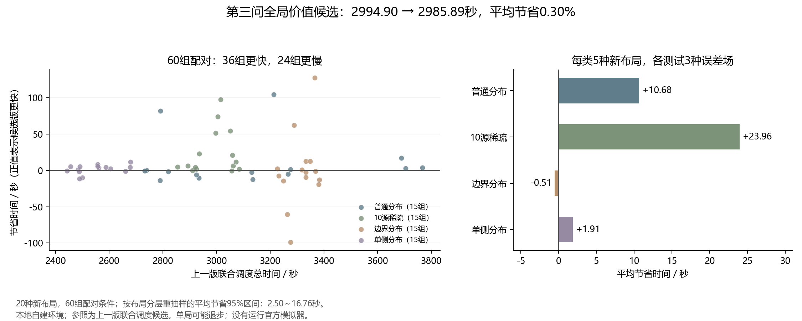

# 第三问全局动作价值实验与本地验证

本轮得到一个**小幅正收益的候选方案**：在冻结后的20种新布局、60组配对条件中，相对上一版联合调度，平均总时间从2994.90秒降至2985.89秒，节省9.01秒（0.30%）。36组更快、24组更慢，最大退步99.02秒。适合保留作候选，还不足以替换默认入口或宣称大幅优化。

比较对象 `original` 是上一版 `route_interleave`，不是默认lean，也不是上轮已否决的成本修正版。每组使用相同布局和误差场。跨轮布局不同，不能把本轮均值与旧报告均值直接相减，也不能直接叠加各轮降幅。

所有工作均在本地完成，没有运行或连接官方模拟器。默认lean、上一版联合调度及其启动入口均未改动，第四问未涉及。



## 1. 本轮检验的模型问题

原全局路线将已发现源的位置集合用一个中心点表示。局部策略则单独比较如何尽快清除当前源，实际落点可能是测点或光学清除点，和中心点不同。这种拆分没有完整计入：

- 落点改变后，继续访问其他源和扫描点的路程。
- 在该落点按原规则顺便检测未知频道，可能减少的后续扫描任务。
- 在该落点给其他已知源测向，可能减少的后续定位工作。

本轮将这些因素逐层加入，并比较收益，而不是同时改掉位置集合、覆盖证书和局部定位模型。沿用原局部成本，避免把上轮成本修正与本轮全局价值混在一起。

## 2. 从有限任务路线构造价值修正

设当前源的位置集合中心为 \(c\)，动作落点为 \(q\)，当前已知源及必要扫描点的任务集为 \(\mathcal T\)。令 \(R(x,\mathcal T)\) 表示从 \(x\) 出发访问这些代理任务的启发式开放路线长度，速度为5米/秒。

对于尚不能保证完成清除的动作，路线修正为：

\[
\Delta_{\rm route}(a)=
\frac{R(q,\mathcal T)-\|q-c\|-R(c,\mathcal T\setminus\{c\})}{5}.
\]

原局部成本已经包含接近并处理当前源的费用，所以先扣除孤立的“落点到当前中心”路程，再加入联合路线。对于保证完成清除的动作，后续任务不再包含当前源，也不再减去该接近路程。已有光学覆盖序列保持承诺，不因重新评分丢弃后续覆盖点。

对可保证一次清除的位置集合，还在合法清除区域内搜索兼顾进入和离开路程的落点；原落点始终作为候选保留。其他源和扫描点仍是基于已知信息的代理位置，路线修正不是实际未来时间的精确值。

覆盖修正 \(\Delta_{\rm cover}\) 的计算步骤为：

1. 沿用真实程序的顺便检测门槛，确定在候选落点会检测哪些未知频道。
2. 复制各频道的剩余覆盖状态，在副本中计算这些检测全部返回无信号后的变化。
3. 仅当其余扫描点仍能覆盖所有剩余频道的全部未排除网格时，才删除冗余扫描点。
4. 计入现场检测、频道切换和后续扫描的费用差，以及删除扫描点后的路程差。

最终入选版采用：

\[
\widehat J_{\rm global}(a)=\widehat J_{\rm local}(a)
+\Delta_{\rm route}(a)+\Delta_{\rm cover}(a).
\]

各项都以秒计。假设反馈只用于排名，真实证据数组不变；只有实际收到有效无信号反馈，才更新覆盖记录。如果一次非保证成功的光学尝试失败，程序不会在该点触发顺便检测，因此该类候选也不预先获得顺便检测收益。

**适用边界：**无信号分支是搜索收尾成本的设计情景，不是对反馈概率的估计。实际可能发现新源；未来路序、测点、共享观测均会变化。路线仍使用位置集合中心代理，局部成本仍含有限前瞻和面积积分假设，因此不能称为贝叶斯最优、完整动态规划或严格最坏情形最优。

## 3. 四个层次的消融

| 配置 | 增加的内容 | 最终开发集平均节省 |
|---|---|---:|
| `route` | 实际落点对应的后续路程；清除落点兼顾进入和离开 | −10.87秒 |
| `coverage` | 在上项基础上，逐频道计算剩余扫描成本变化 | **+1.24秒** |
| `waypoints` | 再加入下一任务位置及其中间位置作为测点候选，仍需接收保证 | −14.64秒 |
| `shared` | 再估计对最多两个其他已知源的共享测向收益，并扣除测量费用 | −93.46秒 |

开发集为6种布局，每种smooth、extreme两类误差场，共12组条件；五个配置共60次完整运行，全部通过审计。只按开发平均选择 `coverage`，然后冻结24个源文件及后续测试方案。此前首版单局烟雾测试和分支诊断单独保存，不混入最终开发均值。

`shared` 使用原顺便测向的资格筛选，并以4个面积样本和三种误差情景估计其他源的后续定位成本变化。这些是设计积分点，不是已知概率后验。其在12组开发条件中仅1组更快、11组更慢，平均移动费用增加84.54秒，是这次激进版本的主要退步分项。现有信息价值近似没有稳定兑现为整局收益，因此没有将它送入留出测试，也没有据此改变正式程序。

证据：[开发选择与冻结记录](results/value_selection.json)、[执行分项分析](results/value_execution_analysis.json)。

## 4. 局部受控分支为什么仍有参考价值

复用了上一轮六局中的12个决策状态、42条已验证分支。重新执行基准以恢复完整公开状态，再按新全局评分重排同一批动作；六局事件记录与旧基准完全一致。评分过程没有改变真实覆盖状态或任何源的位置集合，候选列表保留原局部最优动作。

| 固定分支的排名方式 | 相对有限候选中事后最佳者的平均整局差距 | 平均单源差距 |
|---|---:|---:|
| 原局部评分 | 9.24秒 | 2.47秒 |
| 路线修正 | 9.24秒 | 2.47秒 |
| 路线＋覆盖 | 9.24秒 | 2.47秒 |
| 再加共享测向价值 | 4.45秒 | 3.07秒 |

共享价值改变了4个状态的选择：单源结果略差，整局结果反而更好。它支持“局部和全局目标可能不一致”这一观察；但完整开发任务又出现退步，说明少量已知状态上的排名改善不足以证明新策略有效。

这里复用的是执行替代首动作、随后继续原策略的实际分支结果，不是整局都使用新策略的结果。状态刻意选自旧的成功/退步案例，旧留出数据本轮已经属于开发资料。事后最佳动作依赖实际隐藏参数，既不是可实现的全知策略，也不是不偏的泛化估计。

证据：[受控分支与全局评分](results/value_diagnostic.json)。

## 5. 冻结后的60组配对测试

在看结果之前固定了四类分布，各5种新布局，每种使用smooth、hash、extreme三种误差场：

| 分布 | 上一版平均时间 | 候选版平均时间 | 平均节省 | 更快／更慢 |
|---|---:|---:|---:|---:|
| 普通分布 | 3127.49秒 | 3116.81秒 | 10.68秒 | 7／8 |
| 10源稀疏 | 2989.69秒 | 2965.73秒 | 23.96秒 | 13／2 |
| 边界分布 | 3313.21秒 | 3313.71秒 | −0.51秒 | 6／9 |
| 单侧分布 | 2549.20秒 | 2547.30秒 | 1.91秒 | 10／5 |
| 合计 | **2994.90秒** | **2985.89秒** | **9.01秒（0.30%）** | **36／24** |

20种布局为独立重抽样单位，同一布局的三个误差场始终一起处理。在四类分布内分层重抽样10000次，平均节省的95%区间为 **2.50～16.76秒**。这是自定义分布、有限布局下的统计估计，不能外推为官方成绩保证。

最大节省127.71秒，最大退步99.02秒，两者都出现在同一边界布局的不同误差场中。这也说明只看布局图或单一误差场，会漏掉重要波动。测试后未继续调整参数或根据单局结果选择配置。

平均移动时间减少6.02秒，平均测向次数从120.63降至119.88次，少0.75次。最后一次成功清除之后的平均收尾时间却从401.63增至404.23秒，**本轮没有改善这个阶段的平均耗时**。该阶段已经包含在总时间里，不能重复相加。单侧分布的基准平均收尾约1354秒，仍是值得单独研究的费用。

候选版平均计算耗时5.10秒，基准4.80秒，约增加6.4%。这是同一本地运行环境中的实测计算时间，受并发负载影响；与题目累计的虚拟动作时间分开报告。运行环境为Python 3.14.0、NumPy 2.4.1、Matplotlib 3.10.8；不能用本轮计算耗时与其他解释器环境下的旧结果直接比较。

证据：[完整留出统计与逐组差值](results/value_holdout_summary.json)、[本地环境记录](results/value_environment.json)。

## 6. 压力检查与合理性验证

另用9个固定特殊场景，包括源重合、边界、小距离阈值、共线、密集簇、接收半径混合以及量化边界。两种策略均完成，候选平均节省5.33秒；3组更快、3组相同、3组更慢，最差退步22.03秒。压力样例不并入随机留出均值。

留出与压力检查合计138次运行，全部完成并通过以下独立检查：

- 按题目动作费用重新计算时间，逐条核对反馈与清除结果。
- 从实际无信号点重新检查连续区域的完成证书。
- 检查11048个位置集合、837条光学覆盖路径。
- 用一般多边形射线法和独立路径包含算法交叉核对，处理上一轮发现的微小非凸折边审计问题；保留对真实凹缺口的拒绝测试。

另外4项针对性测试通过，覆盖路线费用不重复计算、假设覆盖不污染证据、新增测点满足接收条件、审计能拒绝真实排除错误。求解器只能通过公开位置、频道和检测/清除接口行动；验证器读取隐藏位置用于检查，两者用途分离。

候选在69次运行中记录了1124次全局选择，330次偏离原局部首选，其中最终动作17次为测向、313次为清除。这个计数不是各项收益的因果分解，但表明当前实现的有效调整主要发生在清除相关动作，不能把0.30%收益描述成多源联合定位的突破。

证据：[压力结果](results/value-stress/summary.json)、[验证计数](results/value_execution_analysis.json)、[针对性测试](test_global_value.py)。

## 7. 保留方案与复现

保留 `coverage` 作为独立本地候选；其余配置保留作消融证据，不改默认入口。更激进的共同测点和共享信息收益模型本轮未带来整局改善。后续若继续投入，建议先独立分析未知频道的覆盖收尾与可达到的路程下界，再决定是否值得修改全局搜索模型。该方向本轮尚未实现，也没有预先承诺收益。

模型代码：[全局价值评分](global_value_policy.py)、[候选求解器](value_solver.py)、[配对基准](benchmark_value.py)、[几何验证](value_validation.py)。求解器只需NumPy；当前基准的独立几何交叉检查还需要Matplotlib。

本地程序调用方式：

```python
from value_solver import solve_multi
result = solve_multi(public_api, schedule='coverage', trace=[])
```

在仓库根目录复现普通分布；输出目录必须尚不存在：

```powershell
python -X utf8 q3_model_v2/benchmark_value.py --start-seed 10000 --seeds 5 --fields smooth,hash,extreme --schedules original,coverage --population uniform --split holdout --out q3_model_v2/results/value-reproduce-uniform
```

其余分布分别为 `sparse10` 的10100～10104、`boundary10` 的10200～10204、`one_side10` 的10300～10304；压力检查使用 `--population stress --split stress`。这些命令仅运行自建环境。

已保存结果的汇总与图表可运行 `summarize_global_value.py`、`plot_global_value.py` 重建；两者默认读取本轮固定结果目录。冻结的选择记录不可覆盖，复现实验应另用目录，而不是重新写入原选择文件。
