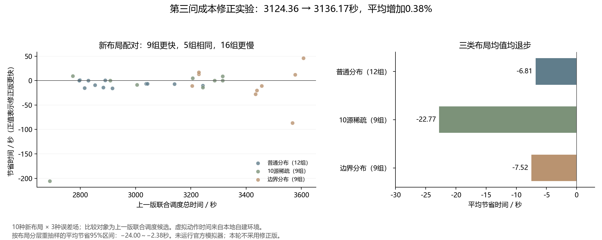

# 第三问成本预测诊断与本地验证

本轮结论：**不采用成本修正版。** 在开发集上最好的修正仅节省2.73秒；冻结后，30组新条件平均由3124.36秒变为3136.17秒，增加11.81秒（0.38%）。这一结果不支持用更复杂的局部预测替换上一版。

比较对象是上一轮的联合调度候选 `route_interleave`，本轮记作 `original`。它不是默认的 `lean`，也不是最初的求解程序。不同轮使用不同布局，不能直接比较跨轮平均时间。默认入口仍为lean，联合调度候选入口也保持原样。全部实验在本地自建环境完成，没有连接官方模拟器；第四问未涉及。



## 1. 先验证怀疑，而不是直接增加模型复杂度

原局部评分用有限个位置样本和误差情景，估计“当前动作之后，清除这个源还需要多久”。其中后续测向按固定几何规则推进，使用零误差反馈，前瞻三步后接启发式尾项。但真实执行会重新决策，也可能改用光学覆盖。因此，预测与执行确实不完全一致。

本轮从上一轮的六个成功/退步案例中，各取一个较大位置集合和一个允许光学覆盖的位置集合，共12个决策状态。在完全相同的已知信息处，分别执行原动作和少量替代动作，共42条分支，随后比较：

- 只处理当前源、关闭沿途协同后的剩余清除时间。
- 恢复原联合调度策略后的整局剩余时间。

六局原策略的重放，以及从截取状态继续执行，都与原事件记录完全一致。42条分支的动作反馈、时间、完成证书和位置集合审计均通过。真实位置只供本地环境和事后审计使用，不传入求解器。

原动作相对这组有限替代动作中“事后最快者”的平均差距为：单源2.47秒，整局9.24秒。以 `8304-uniform-extreme` 的光学阶段为例，原动作与各自事后最佳分支的差距，单源为3.06秒，整局为59.99秒。两个最佳分支未必是同一个动作，不能把两种差距直接相减作为协同收益。

这些是**刻意选取状态上的事后差距**，混合了未知真值、有限候选集和策略近似的影响。它们既不是可实现的性能上限，也不能全部归因于成本预测错误。这些旧留出案例本轮已作为开发资料使用，不再充当独立测试证据。

同时检查了旧预测中的1296条情景分支、1164个后续测点：未发现不能保证接收或重复测点。因此，“旧预测主要靠不可执行动作低估成本”这一怀疑，在本次样本中没有得到支持。预测也并非总是偏低，例如一个宽区域状态预测256.54秒，实际隔离清除为186.71秒。

证据：[分支诊断汇总](results/cost-diagnostic-full/summary.json)、[分支明细](results/cost-diagnostic-full/rows.json)、[预测与排序检查](results/cost_diagnostic_analysis.json)。

## 2. 尝试了哪些模型修正

位置集合、测点候选生成、12个面积积分样本、风险权重0.2、真实光学覆盖策略和外层联合调度均保持原规则；只改变局部测向动作的成本评分。

| 配置 | 改动 | 仍然存在的近似 |
|---|---|---|
| `original` | 使用上一版评分 | 固定后续几何规则、后续零误差、启发式尾项 |
| `legal` | 在预测内检查接收条件、避免重复位置、加入1500米接收上界约束，并计入实际采用的清除终点规则 | 后续仍用零误差反馈 |
| `bounded` | 在上一项基础上，传播−1°、0°、+1°的固定误差情景，加入两位小数反馈量化 | 三种常偏差场只是设计情景，不代表所有允许误差场 |
| `policy` | 再允许小位置集合使用可验证的光学覆盖作为预测终止策略 | 光学尾策略和真正的逐步重新决策仍不完全一致 |

评分结构可写为：

\[
\widehat J(a)=t_{\rm move}(a)+5+t_{\rm switch}(a)
+0.8\,\operatorname{mean}_{g}\overline C(g,a)
+0.2\,\max_g\overline C(g,a),\qquad
\overline C(g,a)=\operatorname{mean}_{e\in\{-1,0,1\}}\widehat C(g,e,a).
\]

这里的面积样本不是从观测推导出的概率后验，误差平均也不是官方给定分布；先对误差平均、再取位置样本最大值，更不能称为对全部误差的最坏情形保证。三步之后仍保留原启发式尾项，所以本轮属于成本近似的消融实验，不是完整动态规划，也不是严格鲁棒最优控制。预测情景从不写入真实位置证据。

还将预测中的清除终点计算改写为与原线段规则等价的闭式解，以控制计算开销。3项针对性检查通过，包括100组几何中闭式解与原二分法一致、光学覆盖检查，以及预测测点接收与去重检查。真实执行仍调用原清除规则。

代码：[成本评分](forecast_policy.py)、[独立实验求解器](forecast_solver.py)、[针对性检查](test_forecast.py)。

## 3. 开发选择与冻结后的结果

最终开发集包含6种布局、每种2种误差场，共12组配对条件；四个配置全部完成并通过原审计。此前用于性能排查的首版烟雾测试单独存档，不混入最终开发统计。

| 修正 | 开发集平均节省 | 更快 / 相同 / 更慢 |
|---|---:|---:|
| `legal` | 2.52秒（0.077%） | 7 / 2 / 3 |
| `bounded` | 2.73秒（0.084%） | 7 / 2 / 3 |
| `policy` | 1.94秒（0.059%） | 6 / 0 / 6 |

按开发平均选择 `bounded` 后，先保存源码指纹及测试方案，再测试10种新布局，每种使用smooth、hash、extreme三种固定误差场，共30组配对条件。运行后没有根据结果继续调参。另有9个固定特殊场景，作为压力检查而非随机泛化样本。

| 新测试条件 | 组数 | 上一版平均时间 | 修正版平均时间 | 修正版增加 |
|---|---:|---:|---:|---:|
| 普通分布 | 12 | 2937.14秒 | 2943.95秒 | 6.81秒 |
| 10源稀疏分布 | 9 | 3082.38秒 | 3105.14秒 | 22.77秒 |
| 边界分布 | 9 | 3415.96秒 | 3423.48秒 | 7.52秒 |
| 合计 | 30 | 3124.36秒 | 3136.17秒 | **11.81秒（0.38%）** |

30组中9组更快、5组相同、16组更慢。最大节省45.93秒，最大退步205.82秒。以布局为重抽样单位、保持同布局三个误差场在一起，并在三类分布内分层重抽样10000次，平均“节省”的95%区间为 **−24.00至−2.38秒**。这只是10种新布局在自定义环境中的有限样本估计，不是官方场景的置信保证。

额外9个特殊场景也均完成清除，平均从2325.74秒增加到2328.99秒，增加3.25秒；2组更快、4组相同、3组更慢。特殊场景没有并入30组均值。

本地平均计算耗时从6.78秒增加到9.33秒，约增加38%；这与题目累计的虚拟动作时间是两个指标，不能直接相加解释官方成绩。运行耗时也受本机负载影响。

证据：[冻结与选择记录](results/cost_selection.json)、[全部配对统计及区间](results/cost_holdout_summary.json)、[特殊场景统计](results/cost-stress/summary.json)。

## 4. 为什么更细的评分没有带来收益

开发集收益本来就很小，换新布局后消失，表明这次修正不足以提供稳定收益。在选取的12个状态中，用新评分重排固定分支，最好也只是把平均单源事后差距从2.47秒降到1.89秒；并没有出现足以支持大幅降时的信号。

新测试中平均测向次数从126.23次增加到128.40次，平均移动时间从2291.29秒增加到2299.00秒。增加模型细节并不必然选择更省时间的动作。

最差退步局 `9501-sparse10-smooth` 的首个动作差异出现在第46个动作：修正版更换了一个测点。整局之后累计多用移动135.82秒、多测向11次（55秒）、多切换6次（6秒）、多失败清除3次（9秒），合计增加205.82秒。最后一次成功清除后的收尾也从0秒变为86.24秒；**收尾是总时间中的一个阶段，已经包含在前面的分项里，不能再相加。**

这个案例说明局部动作可以引发较大的后续差异，但不能仅凭它认定某项调度改动必然有效。当前更值得验证的模型假设是：单源成本评分遗漏了动作终点对其他源和未搜索区域的价值。下一步若继续，应先用少量受控分支区分“当前源清除耗时”和“动作之后的全局服务、覆盖耗时”，再决定是否引入该价值项，而不是直接再加深前瞻。

## 5. 一次几何审计误报及独立复核

原冻结审计的78次运行中77次通过。另一局为上一版的 `9502-sparse10-hash`：实际全部清除，但第127号轨迹记录的位置集合检查失败，因此原始 `passed=false` 和异常信息完整保留。

原因是该多边形在测点附近形成了约 **1.17×10⁻⁷米** 的微小折边。原验证器假设多边形严格凸，逐边检查半平面；这个数值上微凹的折边使它误判真实位置。复核没有扩大原来10⁻⁵米的边界容差，也没有把多边形换成凸包。

新增补充审计采用一般多边形的射线法，并逐个与Matplotlib独立路径包含算法交叉检查；另设真实凹多边形缺口的反例，避免把落在凸包内误当成落在原集合内。11个针对性回归例通过。

随后从保存的动作记录离线重放全部78次运行，逐条核对原反馈和时间，重算完成证书，检查6420个位置集合和496条光学覆盖路径，全部通过。两种包含算法一致；原半平面算法仅在同一局的3条位置记录上发生误报。求解器和原冻结验证器都未修改，原始测试结果也没有重写。

因此，报告中应区分“原审计77/78通过”和“补充复核78/78通过”，不能把前者悄悄改成全通过，也不能把验证器误报解释为新成本模型提高了可靠性。补充检查代码：[离线审计](audit_forecast_results.py)；完整证据：[补充审计结果](results/cost_polygon_audit.json)。

## 6. 保留结果与复现

本轮成本修正版保留为实验代码，不接入官方启动入口。上一版联合调度模型和默认lean都保留。没有因为某一局变快而选择性汇报，也没有针对新测试继续选参数。

在仓库根目录可以运行以下本地复现示例；输出目录必须尚不存在：

```powershell
python -X utf8 q3_model_v2/benchmark_forecast.py --start-seed 9400 --seeds 4 --fields smooth,hash,extreme --schedules original,bounded --population uniform --split holdout --out q3_model_v2/results/cost-reproduce-uniform
```

其余新布局为sparse10的9500至9502、boundary10的9600至9602，字段与配置相同。特殊场景使用 `--population stress --split stress`。相同源码、环境和种子可重现动作轨迹；计算耗时会波动。原审计的已知误报仍可能使对应命令以非零状态结束，应对照补充审计，不能忽略其他新异常。

检查已保存的本轮78次运行、重算汇总与图表：

```powershell
python -X utf8 q3_model_v2/audit_forecast_results.py
python -X utf8 q3_model_v2/summarize_forecast.py
python -X utf8 q3_model_v2/plot_forecast_results.py
```

求解与基准只需NumPy；补充交叉审计和绘图还需Matplotlib。补充审计默认读取已保存的本轮结果目录，不会启动官方接口或重新运行求解策略。
