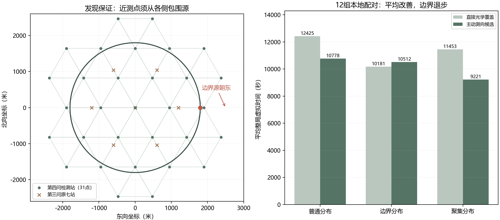

# 第四问：定向可见性、连续发现证书与清除决策

本目录是第四问的首个独立本地原型。第三问的lean冻结程序保持原样。第四问的模型依据是题面关于混合类型、固定接收半径、180度辐射半平面和仅依赖距离的光学清除规则；目前没有接入官方模拟器。

后续已完成[25站覆盖与联合路线改进](第四问覆盖与联合路线改进.md)，当前本地推荐配置为shared。本文保留首版模型、参数和实验记录，不将后续成绩混入原表。

## 1. 第三问哪些内容可以复用

实际时间公式保持不变：

$$
T=L/5+5N_m+N_s+5N_++3N_-.
$$

收到示向度仍然可以用有界误差楔形约束位置，收到near仍可在该测点光学清除，光学覆盖也仍可用连续几何验证。代码只读取第三问冻结的几何模块以及用于本地测试的环境，没有调用第三问求解器或官方客户端。

需要重建的是无信号解释、可靠发现判据和主动测点排序。不能把第四问无信号直接转换为1000米排除圆，不能直接使用第三问的正负点距离半平面，也不能认为在1000米内必定取得示向度。

## 2. 位置、类型、半径与朝向的相容模型

对一个已经发现但未清除的频道，未知状态写成

$$
X=(g,R,z,\phi),\quad g\in\Omega,
\quad1000\le R\le1500,\quad z\in\{\text{全向},\text{定向}\}.
$$

全向模式不需要朝向变量。定向模式中令 $n(\phi)=(\cos\phi,\sin\phi)$，检测点 $q$ 可见的条件为

$$
V(X,q)=\bigl[\|q-g\|\le R\bigr]\land
\bigl[z=\text{全向}\ \lor\ n(\phi)^T(q-g)\ge0\bigr].
$$

有信号意味着 $V$ 成立，正常示向度再加入角度楔形和距离大于5米的条件，near给出距离不超过5米。无信号则意味着

$$
\|q-g\|>R
\quad\lor\quad
\bigl[z=\text{定向}\land n(\phi)^T(q-g)<0\bigr].
$$

这是一个析取条件，不能把其中的距离分支当成无条件事实。清除失败单独给出 $\|q-g\|>20$，与朝向无关。未发现频道还应包含“不存在”的可能性。

### 2.1 用半径区间检验离散情景

给定一个候选位置和类型、朝向，设正测点集为 $W$、负测点集为 $Q$。首先要求全部正测点在该朝向下可见，随后计算

$$
R_{\min}=\max\{1000,\max_{w\in W}\|w-g\|\},
$$

$$
R_{\max}=\min\{1500,\min_{q\in Q:\ q\text{在该朝向下可见}}\|q-g\|\}.
$$

由负点产生的上界为严格上界，实现向内减一个小余量。背面负点不限制半径；全向模式中全部负点都参与半径上界。只有区间非空的情景保留，再结合失败清除的距离条件筛选。

这利用了同一个源的半径固定这一事实，但没有使用第三问专属的无条件距离排除。程序保存完整观测历史，可以复核每个情景是否相容。

### 2.2 用于排序的离散表示与用于保证的外逼近

当前实现用16个确定性面积位置点、24个等间隔朝向和一个全向模式构造有限情景。初始给予两种类型各0.5的设计权重，再把定向权重均分到24个朝向；可行半径区间取中点作为代表。观测不相容的情景被删去，剩余权重归一化。

这些是计算预算内的工作假设，**不是题目给定的源类型比例或贝叶斯后验**。位置点和朝向点不能穷尽连续状态；若全部情景被筛掉，只停止使用这次情景评分，转入光学覆盖，不据此宣布源不存在。

另维护由真实正观测形成的凸位置外逼近 $\overline P$，采用第三问已验证的圆外逼近和 $1.0050001^\circ$ 几何半宽。该角度余量依赖最近0.01度取整假设，接口若采用截断需重核。为保持首版逻辑清楚，本实现的无信号与失败清除仅进入历史和情景筛选，不对 $\overline P$ 作位置删减。因此仍有信息利用不足，但不会由于将背面反馈误作距离证据而删除真源。

## 3. 任意朝向的发现证书

对一组实际检测点 $Q$，在可能源位置 $g$ 附近取

$$
Q_g=\{q\in Q:\|q-g\|\le1000\}.
$$

覆盖任意接收半径和任意180度发射朝向的充要条件为

$$
g\in\operatorname{conv}(Q_g).
$$

充分性：若 $g=\sum_j\lambda_jq_j$，其中 $\lambda_j\ge0$、$\sum_j\lambda_j=1$，则对任意 $n$，有 $\sum_j\lambda_j n^T(q_j-g)=0$。这些内积不能全部严格为负，至少一个近测点位于有效辐射半平面。边界包含在有效覆盖内，故也计为可见。

必要性：若 $g$ 在近测点凸包之外，严格分离可给出使全部近测点位于背面的发射朝向。选择允许的最小半径1000米，则其余远测点也收不到信号。因此不能对所有允许源状态保证发现。

这解释了圆外检测点的必要性。例如源在 $(1800,0)$ 朝东发射，第三问的原点加半径1200米六站全部处于其西侧，可能始终无信号。单纯增加圆域内部的测点仍不能解决该边界案例。

### 3.1 可证明的三角网构造

采用边长950米的等边三角网，保留所有与目标圆域相交的三角形及其顶点，包括圆域外的顶点。每个目标位置属于至少一个保留三角形；它到该三角形任一顶点的距离不超过边长950米，且位于三个顶点的凸包中。因此三个顶点足以保证发现该位置的任意朝向源。

这里950米是留有50米距离余量的可行构造，尚未优化网格尺度、站点数或巡回路线。网格以整个连续三角形为覆盖对象，不以有限源样本或角度采样作为证明。

### 3.2 让途中负点也参与证书

对一个三角形 $\Delta$，若某负测点到其三个顶点均不超过1000米，则由距离凸性，该负点到三角形内任意位置也不超过1000米。将这类点组成 $Q_\Delta$。如果

$$
\Delta\subseteq\operatorname{conv}(Q_\Delta),
$$

则三角形内任意可能源、任意朝向都应被其中至少一点探测到。该频道在这些实际点却均无信号，因此三角形内没有该频道的未清除源。

实现通过检查三角形三个顶点都在负点凸包内完成连续判断；圆距离检查保留数值余量。这里的凸包是覆盖证书，而非把阴影负反馈错误转换成位置凸集。全部保留三角形均有证据时，才认定未发现频道不存在。只使用实际接受的、本频道的负读数，不使用拟访问点或预测结果。

## 4. 不受朝向影响的局部清除后备

给定位置外逼近 $\overline P$，沿其直径方向建立正交坐标系，求包含整个多边形的矩形。将矩形划分为小矩形，每个小矩形的半对角小于20米，在各中心执行光学清除，就能覆盖全部候选位置。

若两边长为 $a,b$，选取 $n_x,n_y$ 使

$$
\frac12\sqrt{(a/n_x)^2+(b/n_y)^2}<20.
$$

当前以 $\sqrt2(20-10^{-4})$ 米作为单元边长上限。每个单元都有对应的清除点，故证明覆盖整个矩形及 $\overline P$。选择四种蛇形遍历方向中评分最低者，第一次失败后继续同一完整序列；几何保证不依赖情景是否碰巧包含真源。

从当前位置 $q_0$ 出发，第 $j$ 个点成功的费用为

$$
T_j=\frac15\sum_{k=1}^j\|q_k-q_{k-1}\|+3(j-1)+5.
$$

光学评分采用面积情景首次命中费用的0.8均值加0.2整条路径最坏费用。即使类型或朝向估计不准，只要外逼近有效，这个有限计划仍有清除覆盖依据。矩形会覆盖部分不可能区域，因而只是简洁可靠的首版后备，不是最少光学尝试的算法。

## 5. 两种局部策略与整体流程

`optical` 对照策略：发现频道后，若near或已有一个20米圆可覆盖区域则直接清除；否则使用上述完整矩形覆盖。

`active` 候选策略：在同一光学后备之外，比较10个按中心、主轴和横向40/100米偏移构造的测点，排除历史重复点。它允许无信号，不强行要求候选点对全部类型和朝向都可见。

对每个情景预测能否接收。有信号分支用 $-1^\circ,0,1^\circ$ 三个当前误差代表值生成后验位置外逼近，并估计随后执行光学覆盖的费用；无信号分支保留当前位置外逼近，估计从新点执行光学覆盖的费用。测量评分为

$$
J_m(q)=\|q-s\|/5+5+\mathbf1\{c\ne c_{\rm current}\}
+p_{\rm sig}\widehat C_{\rm positive}
+(1-p_{\rm sig})\widehat C_{\rm negative}.
$$

其中 $p_{\rm sig}$ 是设计情景权重之和，不是真实接收概率保证。若该评分低于当前光学方案，则执行一次真实测量，再根据反馈更新；最多额外主动测向6次，之后执行完整光学后备。只有真实反馈更新证据，预测分支不会写回实际状态。

整体算法从原点开始，扫描当前尚待发现的频道，按位置代理与当前位置的距离依次处理已发现源，再选择最近的仍有查漏价值的网格站点。每个源通常连续服务到清除，未做跨源逐动作优化。途中产生的实际负点可补充方向覆盖证书。

只有成功清除16个不同频道，或20个频道均已成功清除或取得方向覆盖不存在证据，才能宣布完成。发现16个源后可停止额外搜索，但仍须清除所有已发现源。拒绝或畸形响应不能当作无信号；完整光学覆盖仍失败时返回未完成。

固定三角网与有限光学覆盖提供了在理想规则、有效外逼近和一致反馈下的有限发现与清除构造。当前实现仍使用浮点运算，并受实际运行环境及接口预算约束，不能由有限本地测试推出任意运行环境必定成功。

## 6. 验证方式

两种策略只获得位置、当前频道、检测与清除四项公开接口。真实源位置、类型、朝向、半径和源总数用于自建环境与事后核查，不输入策略。

验证器逐事件重新计算距离、方向可见性、反馈类型、角度误差、成功清除与累计时间，检查正观测外逼近含真源；对光学计划核对完整矩形分区及每个清除中心；对不存在证书使用另一套凸包计算检查三角形覆盖，并核对每个负点确实来自该频道的实际反馈。最后再用本地隐藏真值核对全清。

六项针对性检查覆盖：连续三角网构造与几何取样复查、朝外边界反例、背面负反馈不删除真源且仍可光学清除、矩形覆盖与相容情景、公开接口与非法反馈拒绝，以及退化线段的有界包含性核查。取样是实现核查，连续覆盖结论来自前述几何证明。

开发集采用3种布局各1局；冻结程序后，再使用6种新布局、每种2种固定误差场构成12组配对条件。布局含普通分布、边界朝外/切向分布和聚集分布，边界案例采用最小1000米接收半径。所有评分案例均同时包含全向与定向源。该设计属于小规模首轮本地验证，不能代表官方分布。

### 6.1 冻结后的12组配对结果

当前三角网共有31个检测站、42个覆盖三角形。开发集三个条件中两策略均全清，主动策略均值下降9.64%，但边界案例退步714.38秒；该不利案例原样保留，随后没有据此调参。

| 新测试布局 | 条件数 | 直接光学平均总时间 | 主动测向平均总时间 | 主动策略变化 |
|---|---:|---:|---:|---:|
| 普通分布 | 4 | 12424.62秒 | 10777.57秒 | 减少13.26% |
| 边界分布 | 4 | 10181.29秒 | 10512.39秒 | 增加3.25% |
| 聚集分布 | 4 | 11452.82秒 | 9221.16秒 | 减少19.49% |
| 合计 | 12 | 11352.91秒 | 10170.37秒 | 减少10.42% |

两策略各12次运行均完成全清及证书核查。主动策略9组更快、3组更慢，平均节省1182.54秒；最坏退步802.06秒，发生在 `14100-boundary-hash`。这表明平均收益存在，但不能称为稳定优于对照。

合并单源时间由933.12降至835.92秒/源；逐局单源时间的平均由945.33降至857.13秒/源。这两个口径不同。它们是第四问首版本地结果，与第三问约239秒/源的官方演练不属于同一题设、同一案例或同一证据层级，不能直接据此推断第四问必然慢多少。

主动策略每局平均移动费时7875.62秒，约占总时间77.44%；检测1739.17秒、切频317.00秒、成功清除60.83秒、失败清除177.75秒。相对直接光学，平均失败清除次数由299.83降至59.25，但移动只减少约562.20秒。初版的主要效率瓶颈仍在扫描和多源服务的移动过程，减少失败次数本身不足以解决它。

### 6.2 验证规模与可复核资料

开发与留出合计30次运行，包含374个源实例（含两策略在相同案例中的重复实例），全部通过本地隐藏真值全清检查。独立验证累计核对15634个事件、636个位置多边形、331条完整矩形光学计划和9156份三角形不存在证据；本批独立累计计时与环境记录一致。

主动策略的本地计算平均5.68秒/局、最大8.67秒/局。这个数值不含官方接口往返，也不是官方口径的程序运行时间，更不是任意场景下的运行上界。

结果文件：[开发记录](results/development/rows.json)、[开发选择与源码冻结](results/selection.json)、[留出逐局记录](results/holdout/rows.json)、[留出汇总](results/holdout/summary.json)、[配对分析及全部审计计数](results/analysis.json)。每个案例还保存合成真值、动作事件、状态轨迹和完成证书，可独立复核。源码指纹在两批运行内保持不变，第三问15个冻结文件也重新核对一致。

测试结束后补强了离线复核器对退化线段端点之外位置的拒绝检查，并新增相应测试；只涉及验证器与测试文件。用补强后的验证器重查30份已保存轨迹，审计结果全部与原记录一致，未重跑或改动求解策略。原冻结记录保留，变更及当前指纹见[补充复核](results/audit_revision.json)。

## 7. 目前的结论与下一步

本轮完成的是第四问独立模型与可运行本地初版：能够正确解释背面无信号，使用可证明的全方向发现构造，并把主动测向与不依赖朝向的光学清除接成闭环。尚未形成可推荐的官方测试版本。

下一阶段优先处理两项问题。首先拆分移动路径：固定31站搜索、已发现源的连续服务和查漏尾段各付出了多少路程，是否可以在保留方向覆盖证书的同时联合安排访问。其次诊断边界退步：24个朝向代表值与0.5类型权重是否高估了新点的接收机会，以及局部较低的预测费用是否导致较差的后续落点。两个问题都应在已有记录上先诊断，再冻结有限改动，使用新的布局验证。

当前不根据边界布局标签切换策略，策略也读取不到该标签；不从本地真值选朝向或识别源类型。三角网尺度、有限情景和矩形覆盖均有进一步改进空间，但其收益需通过新的比较确认。第四问官方接口适配、用户演练与正式测试资料尚未完成，第三问主入口不用于第四问。
