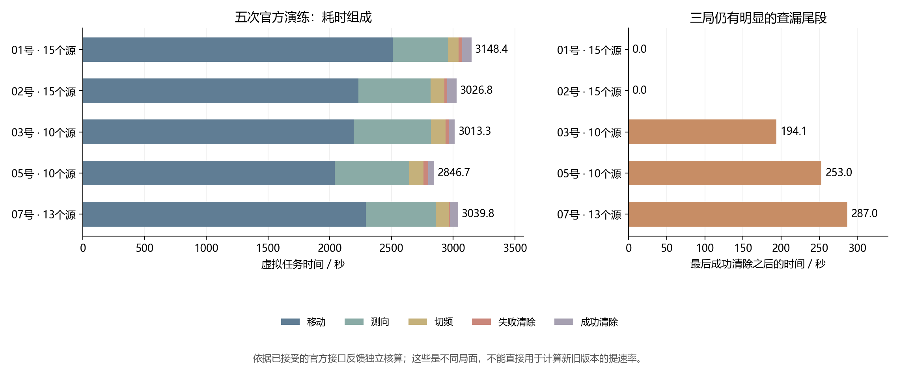
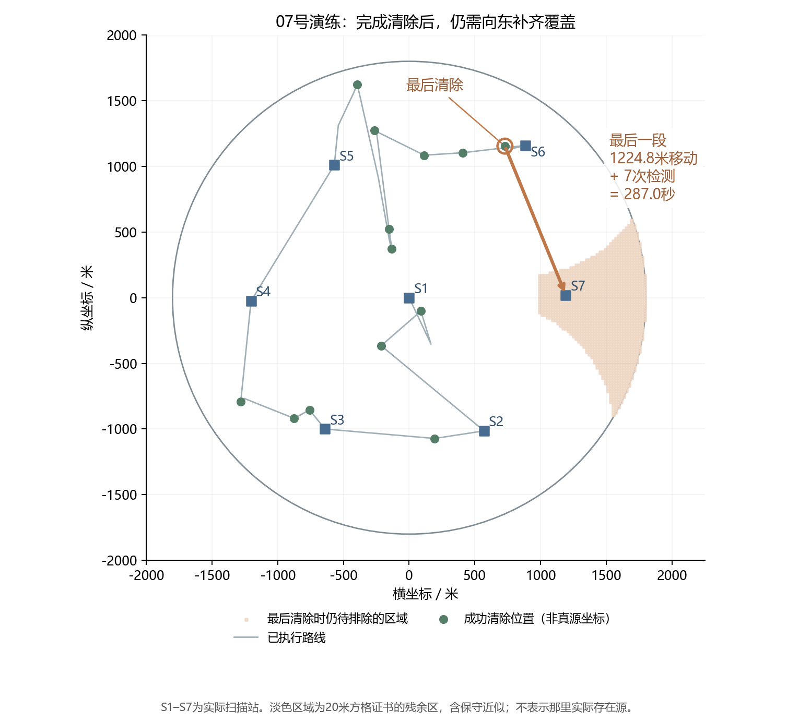

# 第三问：五次官方演练结果分析与下一步

分析日期：2026年9月11日。

输入为用户提供的《测试结果.zip》，包含01、02、03、05、07五份请求/反馈日志及对应候选区域轨迹。用户确认04、06只是跳号，这五次包含全部有效测试。本轮仅离线读取、核算和作图，没有连接官方模拟器，没有运行新策略，第三问求解核心保持冻结；第四问按用户安排延后。

## 1. 结论与建议

**这五次演练支持继续保留当前版本作为可靠基线。下一轮优先研究搜索覆盖与清除路线的联合规划，局部预测一致性随后修正；暂不优先大幅替换定位器。**

理由有三条：五次均正常退出，独立核验的成功清除与不存在证据完整；移动仍占74.76%的总时间；五次都执行了七个扫描任务，其中三次最后清除后仍需额外移动去查漏。这些记录进一步指出了全局规划的具体不足。

局部定位也还有改进空间，但本批63个源只额外触发了38次需要单独选点的主定位测向，另有60次沿途共享测向。测向与光学尝试已经能够相互替代，42次失败清除的总费用只占0.84%。目前更应解决某些必要搜索区域没有被顺路服务的问题。

## 2. 官方反馈汇总

| 演练 | 成功清除数 | 由负测证据排除的频道数 | 整局虚拟时间/秒 | 每源平均时间/秒 | 最后清除后的查漏/秒 | 本地全流程实际耗时/秒 |
|---|---:|---:|---:|---:|---:|---:|
| 01 | 15 | 5 | 3148.45 | 209.90 | 0.00 | 16.55 |
| 02 | 15 | 5 | 3026.76 | 201.78 | 0.00 | 7.34 |
| 03 | 10 | 10 | 3013.32 | 301.33 | 194.09 | 7.47 |
| 05 | 10 | 10 | 2846.74 | 284.67 | 253.03 | 5.12 |
| 07 | 13 | 7 | 3039.79 | 233.83 | 286.97 | 5.93 |

共成功清除63个源。五局平均总时间3015.01秒；逐局的每源平均时间再取平均为246.30秒；将全部时间除以全部清除数为239.29秒/源。后两者权重不同，论文必须明确口径。

表中本地实际耗时从客户端发出进入请求前到退出返回后计量，包含接口往返。压缩包没有官方汇总界面中的“程序运行时间”字段，不能将这列直接冒充那一字段。

五份日志的成功清除反馈以及其他频道的全域负测证据，使我们能够在第三问规则成立的前提下确认完整清除。该判断经过重新检查，并非仅照抄客户端的 `complete=true`。压缩包未包含真源坐标、接收半径和官方结果表，不能进一步检查每条候选多边形是否包含隐藏真值，也不能恢复官方误差场。

这些是不同的官方演练局面。不能直接将3015.01秒与旧本地均值、以前另一局官方演练比较，再宣称某个百分比的提速。

## 3. 已完成的独立核验

1. 五次运行的10个求解与适配文件指纹均与当前冻结版本匹配，配置都是 `lean`。
2. 671个移动、检测、清除动作均收到接受反馈，没有客户端错误、重复成功请求或后备流程触发。
3. 从原点、频道1重新累计路程、检测费、切频费和清除费；与官方返回累计时间的最大差约0.00000395秒。
4. 100个频道的证据均核对到各自实际接受的动作。37个未清除频道分别有覆盖整个1800米圆域的负测依据，与63个成功清除频道共同覆盖五局全部频道。
5. 核验了39个完整光学计划对候选多边形的连续覆盖，以及32次带单点覆盖声明的清除；38次主定位测向均没有发生预期接收失败。
6. 没有同一频道在同一位置重复测向的记录。

这里验证的是已执行动作、声明的几何证书及计时一致性。没有源真值，不能据此推断官方噪声服从均匀分布或高斯分布，也不能把本地真值回放能做的全部检查套用到这些日志。

核验数据：[official_practice_20260911_analysis.json](../results/official_practice_20260911_analysis.json)。

## 4. 时间花在什么地方

按题目费用分解，五局平均为：

| 费用类别 | 平均秒数 | 总时间占比 |
|---|---:|---:|
| 移动 | 2254.01 | 74.76% |
| 测向 | 566.00 | 18.77% |
| 切频道 | 106.80 | 3.54% |
| 失败清除 | 25.20 | 0.84% |
| 成功清除 | 63.00 | 2.09% |

换成任务归属口径，扫描任务的动作及其进入路程平均1350.14秒，占44.78%。这是另一个分类维度，与上表的移动、测向费用重叠，不能相加。

| 演练 | 主定位测向次数 | 沿途共享测向次数 | 额外机会搜索次数 | 失败清除次数 | 扫描任务数 | 扫描任务及进入路程/秒 |
|---|---:|---:|---:|---:|---:|---:|
| 01 | 12 | 10 | 0 | 10 | 7 | 1193.36 |
| 02 | 7 | 17 | 17 | 8 | 7 | 1184.17 |
| 03 | 9 | 5 | 20 | 8 | 7 | 1238.05 |
| 05 | 4 | 11 | 10 | 12 | 7 | 1537.97 |
| 07 | 6 | 17 | 8 | 4 | 7 | 1597.16 |

“主定位测向”不含首次发现、扫描站读数和共享测向，不能将38/63误写成每个源全部测向仅0.60次。总正向测量为161次，平均约2.56次/源。

35个扫描任务中有14个没有新发现。它们仍可能是完成不存在证明的必要行动，不能直接作为可删除的浪费。55次额外机会搜索产生54次无信号和1次首次发现；无信号本身也有覆盖价值。该发现来自07号的频道2。

10个源的03、05号平均总时间2930.03秒，而15个源的01、02号平均3087.61秒。少了三分之一的源，总时间只少约5.10%。这是这五个局面的描述性对比，不能作为源数导致时间变化的因果估计；它与大量搜索覆盖开销存在的证据一致。

## 5. 三局尾段揭示了什么

03、05、07号最后清除后的查漏分别花194.09、253.03、286.97秒。平均到全部五局为146.82秒，约占4.87%；只看这三局则约244.70秒。

但“尾段为零”不能单独作为优化目标。01、02号也有不产生新发现的扫描，只是发生在最后清除之前。把尾段原样提前执行，可能仅改变时间归类而没有减少总时间。

### 5.1 07号的具体例子

07号最后一次成功清除位于约(728.27,1154.16)。此后还要到约(1191.67,20.38)为7个未确认频道检测。移动1224.83米耗244.97秒，7次检测及切频耗42秒，合计286.97秒。

这个时间不是程序卡住，也不是清除失败造成。它服务于最后一块仍可能存在源的区域。

图中成功清除位置只是已知距真源不超过20米的位置，不当作精确源坐标。淡色区域表示最后清除时某未确认频道的网格残余区域，这些频道在该时刻有相同的相关负测位置；它不表示那里实际有源。

### 5.2 为什么不能只降低顺手扫描阈值

我作了一个离线几何检查：将最后清除前所有实际停靠位置都视为可用测点，即使那个位置当时没有测某个未知频道，也算入潜在覆盖。三局仍有物理覆盖空缺。

| 演练 | 圆域内的一个空缺位置 | 它到此前最近停靠点的距离/米 |
|---|---|---:|
| 03 | (1690,-590) | 1168.89 |
| 05 | (-1710,550) | 1220.96 |
| 07 | (1790,-90) | 1530.74 |

这些位置都在1800米目标域内，而且到全部此前停靠点的距离均大于1000米。假如某未知频道在那里存在一个最小接收半径的源，机器狗沿原来的这些停靠点补测也无法发现它。因此，这不是仅由20米网格的保守性产生的假缺口。

这说明：要提前完成可靠覆盖，必须改变某些实际停靠位置，或者仍然保留后续新位置的访问。仅增加原有停靠点的测频道数量，不能解决这三局的全部问题。

上述分析没有生成未观测角度，也没有重跑修改后的策略。它证明当前路线的几何限制，不证明某个新策略能够节省全部尾段时间。

## 6. 下一版建议：让局部动作兼顾剩余搜索覆盖

下一版建议保留现有定位集合、成功清除反馈与查漏证书，把主改动集中在**局部服务方案与剩余搜索路线的共同选择**。

### 6.1 信息状态增加真正用于决策的剩余覆盖成本

对每个未知频道 c 维护残余区域 U_c；已知源继续维护候选区域 P_c。当前代码已有这些状态，但局部动作评分没有充分使用 U_c 对后续全局路线的影响。

对一个候选动作 a，应比较

\[
J(a)=c(a)+\widehat T_{\mathrm{后续清除与查漏}}(I\mid a).
\]

这里的后续时间需要同时包含还未清除的源和还未证明不存在的区域。若比较多种可能反馈，就必须计入各分支，并明确采用情景、概率还是最坏值评价。

一种观测点虽然对当前源稍远，却可能顺便覆盖最后必查的东侧区域；另一种清除落点可能让机器狗更接近下一项必要任务。上述收益应进入动作成本比较，而不是只用“本次排除了多少格”判断是否顺手测一下。

### 6.2 先做可控的联合候选，而非直接全面重写

建议从三个小型几何子问题开始：

1. **终止扫描位置。** 如果只剩一组残余格，令其中心集合为 C、格子半对角为 rho。可靠扫描位置需满足每个 \(z\in C\) 的 \(\|q-z\|\le1000-\rho\)。在这个凸可行域内寻找距离当前位置最近的点，比只沿原站到当前位置的线段选点更完整。
2. **清除落点与下一站。** 对可靠清除位置集合 \(K(P)=\bigcap_{g\in P}B(g,20)\)，同时最小化进入和离开路程，避免只选择最小包围圆中心附近的点。
3. **同一位置兼顾两项任务。** 主动寻找既能给已知源测向或清除、又能消除关键残余搜索区域的候选点。能够重合时共用移动，仍分别支付各频道检测费。

再在附近两三个源与一两个搜索任务间做短程联合比较，允许“先观测A，先去B，稍后清除A”。先控制候选数量与前瞻深度，保留原有可行策略作为后备。完整大规模部分可观测规划不必作为第一步。

### 6.3 下一步仍要修正的局部模型

在增加前瞻深度前，应让后续模拟使用合法的接收条件、固定地点误差，以及与实际执行相符的后续策略。否则加深搜索只是反复使用偏差可能很大的时间估计。

非凸信息保存和决策区域识别仍值得保留为后续分支。本批结果尚没有显示局部反复测向或光学失败费用是主要瓶颈，因此不建议先围绕它们进行全面改写。05号频道3需要9个主局部动作，可作为后续分析复杂光学尝试的具体案例；但该局失败清除总费用仍仅36秒。

## 7. 如何判断下一轮是否值得拿去演练

建议先在本地按以下顺序比较，暂不新增官方操作：

| 对照分支 | 主要改变 | 检查重点 |
|---|---|---|
| 冻结 lean | 不改变 | 保留可靠基线与官方证据 |
| 连续选点改进 | 精确考虑可行清除位置、最后扫描位置 | 是否减少局部进入/离开路程，完成证书是否保留 |
| 覆盖与服务联合 | 后续成本同时包含未知区域与已知源 | 整局时间、扫描进入路程、是否只是把尾段提前 |
| 一致的局部展开 | 改善反馈与后续动作预测 | 动作选择是否更稳健、真实计算时间是否可接受 |
| 少量组合 | 仅合并已显示独立价值的分支 | 增益是否保留，最坏案例是否退化 |

本地场景优先补充10个源、较多空频道、边界稀疏、需要最后补一侧覆盖等结构。应使用多个新布局和多种固定误差场；这些官方日志已经被看过，应作为诊断与回归材料，不能继续视作未参与设计的留出数据。

日志没有真坐标、真实R以及未去位置的反馈，无法据此精确重建官方局面并公平重跑另一算法。可以建立具有相似结构的本地案例，清楚标为自建；不能把猜出的坐标和噪声补全后称为官方复现。

模型验收以全清依据、整局总时间、较慢案例的退化及实际计算耗时为主。查漏尾段、失败次数、扫描次数均是诊断指标，不能替代总目标。只有在新的本地配对验证支持后，再由用户执行下一轮官方演练。

## 8. 保存与复现

原始日志按原字节保存在本地 `official_runs/received-20260911`，延续仓库现有规则不纳入Git。分析结果不包含队号与请求身份字段。

- [完整结构化核验结果](../results/official_practice_20260911_analysis.json)
- [离线分析工具](../code/analyze_official_results.py)
- [绘图工具](../code/plot_official_results.py)
- [耗时图](../figures/official_practice_costs.png)
- [07号路径图](../figures/official_practice_07_route.png)

离线分析调用只读取指定目录中的已完成日志，使用已有独立几何核验函数，不会实例化官方客户端或调用求解策略。后续复现分析时，使用该目录作 `--input-dir`，将结构化结果路径作为 `--output` 即可。
