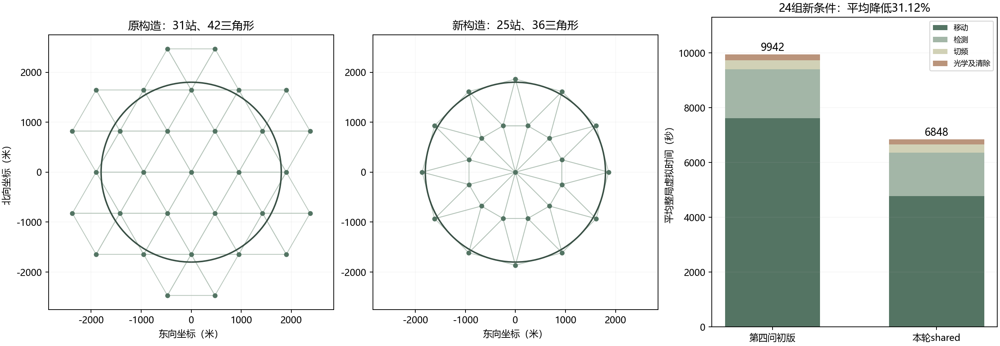

# 第四问：覆盖构造、联合路线与停点复用

交接更新（2026-09-12）：本文记录shared形成时的模型与本地实验；文末未提交状态属于当时记录。此后shared已完成接口验证，并收到使用者提供的[5次官方记录](../../03_官方演练与时间诊断/reports/官方演练五次结果分析.md)及[第四批4次记录](../../03_官方演练与时间诊断/reports/官方演练第四批结果分析.md)。share25及保序删点候选另行归档，当前关系见[第四问导航](../../README.md)，不改变本文实验口径。

本轮在第四问初版上作独立比较，保留原 `solver.py` 与上一轮结果。全部诊断和实验均在本地完成，不连接官方模拟器。改动目标是减少搜索清除总时间，同时保留方向覆盖与实际成功清除的完成依据。

## 1. 先从旧轨迹定位问题

上一轮12组留出结果已经用于本次诊断，应视为已见开发资料，不能继续作为新验证集。按动作发生前该频道是否已经发现，将移动分为前往扫描点、已知源测向和光学清除三类。前往扫描点的路程包含从上一清除位置离开的接驳段，不能将其全部解释为“纯扫描站间路程”。

| 旧案例类别 | 前往扫描点平均时间 | 已知源测向移动 | 光学清除移动 | 最后一次清除后的平均尾段 |
|---|---:|---:|---:|---:|
| 普通分布 | 5955.94秒 | 1437.15秒 | 1387.73秒 | 3311.07秒 |
| 边界分布 | 5532.21秒 | 1197.79秒 | 750.90秒 | 453.31秒 |
| 聚集分布 | 5751.33秒 | 894.07秒 | 719.76秒 | 6118.66秒 |

尾段还包含检测和切频费用，不能与前三列直接相加。聚集源容易在局部较早清完，但未知源数要求继续证明其他频道不存在，故查漏仍有较大成本。边界案例则不同：查漏尾段短，原主动测向的接收预测偏乐观。56次主动测量的预测信号权重合计50.15，实际只有36次收到信号；普通与聚集案例对应为65.49/56和60.34/53。

预测权重不是题目给定的概率，这些差异用于暴露设计假设的局限，不据此把一个小样本误差比当成真实概率修正系数。原始诊断见[移动与接收诊断](../results/movement_diagnostic.json)。

## 2. 由圆域几何推出25站双环覆盖

原方案用等边三角网保留所有与目标圆域相交的三角形，共31站、42个完整三角形。它有明确的发现证明，但边界保留的整个三角形伸出圆域较远，产生额外站点与移动。

本轮改用包围目标圆域的正十二边形，并对其内部作双环三角剖分。令 $m=12$、$\alpha=\pi/m$，外环半径与内环半径分别取

$$
R_o=\frac{1800+10^{-4}}{\cos\alpha},\qquad R_i=960.
$$

外环站角度为 $2\pi k/m$，内环站错开半格，角度为 $2\pi k/m+\alpha$，再加入原点。于是共 $12+12+1=25$ 个检测站。外环多边形的内切圆半径略大于1800米，因此包含整个目标圆域；微小外扩仅为数值余量。

为什么使用12个外环站：该构造要求外环相邻边不超过保证接收半径1000米，故

$$
2(1800+10^{-4})\tan(\pi/m)\le1000.
$$

满足该条件的最小整数为12。这只是当前三角形边长证明方式下的设计选择，不是所有可能方向覆盖方案的站点数下界。

原点与相邻内环站组成12个三角形；每一段环带再分成两个三角形，共36个。四类边长为

$$
R_i,\quad 2R_i\sin\alpha,\quad 2R_o\sin\alpha,
\quad\sqrt{R_o^2+R_i^2-2R_oR_i\cos\alpha}.
$$

当前最大边长约968.62米，小于1000米。$R_i=960$ 是满足全部边长约束的可行值，尚未对路线费用作连续最优求解。

目标域中任一可能源位置属于至少一个三角形，到其三个顶点均不超过1000米，并处于三点凸包内。对任意辐射方向 $n$，这三个向量不能全部满足 $n^T(q-g)<0$，因而至少一个站点能接收该源。这里延续的是覆盖连续位置与全部朝向的几何证明，未利用测试真值选择站点。

不存在证书仍使用同频道实际负测点：对每个三角形，只取到其全部顶点均在1000米内的负点，再检查三角形位于这些负点的凸包内。光学清除和全部任务完成判据保持原规则。代码见[双环覆盖](../../polar_cover.py)。

## 3. 扫描与已知源的统一路线

初版每扫完一站，就先处理所有已发现源，再前往最近未扫站。这会把搜索和清除分成两段局部决策；已知源较远时可能打断一条原本连贯的扫描路线。

新方案把仍需要访问的扫描站与已发现源的位置代理放入同一个开放路径问题。源代理采用当前位置外逼近的最小包围圆中心；它不是真源，也不是强制访问的清除点。当前规划目标为

$$
\min_{\pi}\ \|p_{\pi_1}-s\|+
\sum_{j=1}^{K-1}\|p_{\pi_{j+1}}-p_{\pi_j}\|.
$$

无需回到起点。实现采用四个较近起点的最近邻路线，再进行有限轮开放路径2-opt改进。只执行首个扫描或源处理任务，然后依据实际反馈重建任务集并重新规划。已发现16个频道时立即停止额外搜索，仍需清除完已发现源。

该路线目标只近似处理主要移动费用。检测费、未来发现、局部清除路径及清除落点仍会随执行变化，不能把代理路线长度当成真实剩余任务时间或全局最优值。实际成绩始终按完整动作计费。代码见[开放路线](../../route_planning.py)与[联合求解器](../../joint_solver.py)。

## 4. 在已经到达的扫描点补充测向

访问扫描站时，除未发现频道外，还评估已知源能否利用这次停点。若当前位置已经能用20米圆覆盖其位置外逼近，立即清除；其他已知源则比较“当前点再测一次”的费用与“从当前点直接执行光学后备”的费用。

候选补测须与历史测点相隔至少80米，避免近重复；按预测节省最多选两个频道。每次实际执行前重新计入当前切频成本。补测可以返回无信号，此时只更新该源的相容历史，不作第三问式的无条件负圆排除。

这里复用的是扫描点的位置和已有移动，不是共用一次检测。每个频道均取得自己的实际反馈，分别支付5秒检测和必要的1秒切频。当前只在扫描站作这种补测，没有声称复用所有移动途中或所有清除停点。

## 5. 类型保守评分作为独立比较

原评分把全向和定向情景按设计权重混合。第四问没有给定两种源的比例，边界案例又显示接收权重偏乐观，因此另外测试类型保守评分：对有限情景能表示的每种类型，分别计算测点的条件后续费用，再取较大值。

$$
J_{\rm type}(q)=c_m(s,q)+
\max_{z\in Z_H}\widehat C(q\mid z,H).
$$

$H$ 仍是有限位置、朝向、半径和误差情景，$Z_H$ 是其中存在相容情景的类型集合。该评分减少了对两类型相对权重的依赖，却仍不是全部连续状态和全部误差下的严格最坏时间；离散情景遗漏真实类型时，也不能靠它给出任何完成保证。硬性的覆盖证书与该评分分开。

类型保守化可能减少不利测量，也可能过早使用较长光学覆盖。所以它与常规共享方案分别测试，不能只凭“更保守”就判定更好。代码见[类型条件评分](../../guarded_policy.py)。

## 6. 配置与验证安排

| 配置 | 相对上一行的改动 |
|---|---|
| `baseline` | 上一轮31站、立即服务已知源、原主动测向策略 |
| `polar` | 仅替换为25站双环覆盖 |
| `route` | 再统一规划扫描站与已知源的开放路线 |
| `shared` | 再在扫描停点补充有价值的已知源测向与清除 |
| `guarded` | 在shared上改用类型条件较坏费用 |

开发比较使用六种布局：普通、边界、聚集各两种，分别配置smooth与extreme固定误差场。按完整清除与证书通过的条件筛选，再比较同批平均整局时间，选定配置后冻结源码，用新布局验证。每个版本都使用相同的本地案例与固定误差场，保留全部逐局动作和审计结果。

本轮新增四项针对性检查：双环剖分与连续覆盖构造、开放路线保留全部任务且不劣于其最近邻起始路线、类型条件评分与原混合评分的关系、near及同停点清除的计时与完成分支。完整运行继续使用独立验证器，核对实际反馈、计时、真源包含性、全部光学单元及各频道方向覆盖证书。

### 6.1 六个开发案例的逐项比较

| 配置 | 全清并通过核查 | 平均整局时间 | 相对前一配置的平均节省 |
|---|---:|---:|---:|
| baseline | 6/6 | 9767.36秒 | — |
| polar | 6/6 | 7563.75秒 | 2203.61秒 |
| route | 6/6 | 6907.66秒 | 656.09秒 |
| shared | 6/6 | 6493.00秒 | 414.66秒 |
| guarded | 6/6 | 6557.25秒 | −64.25秒 |

这里每一行都使用同一批六个案例，因而可以比较逐项增加改动后的整体结果；这些变化包含后续轨迹相互作用，不能解释为互不影响的普适模块贡献。停点共享在一个开发案例中略慢于route，但六例均值更低。

选择shared进入新布局验证。类型保守化在两批开发案例中都未改善均值，合并后平均慢64.25秒，约0.99%，因此本轮不采用。其动机与负结果保留，没有为了“模型更复杂”强行加入主候选。

证据：[第一批开发](../results/joint-development/rows.json)、[第二批开发](../results/joint-development-2/rows.json)、[开发选择与源码冻结](../results/joint_selection.json)。新验证预先指定普通、边界、聚集各4个布局，每布局使用hash、extreme两种固定误差场，共24组配对条件，比较baseline与shared。原型及其历史资料不改写。

### 6.2 冻结后的24组新条件

| 布局 | 条件数 | 初版平均总时间 | shared平均总时间 | 平均下降 |
|---|---:|---:|---:|---:|
| 普通分布 | 8 | 10225.89秒 | 6723.69秒 | 34.25% |
| 边界分布 | 8 | 10710.99秒 | 7673.24秒 | 28.36% |
| 聚集分布 | 8 | 8888.40秒 | 6147.27秒 | 30.84% |
| 合计 | 24 | 9941.76秒 | 6848.07秒 | **31.12%** |

两版各24次运行均全清并通过完成证书核查，每版累计294个源实例。shared在24组中均更快，平均节省3093.70秒；本批最小节省为1500.23秒，发生在 `17102-boundary-extreme`。这些是本次样本中的结果，不保证未来每局都改善。

合并单源时间从811.57降至559.03秒/源；逐局单源时间的平均从824.95降至568.37秒/源。它们均对应本轮同批第四问案例，不能与上一轮不同布局的均值或第三问官方演练直接比较。

以12个独立布局为重抽样单位，保持同布局的两个误差场一起，并在三类布局中分层重抽样10000次，平均节省的95%区间为2749.29至3415.84秒，平均下降比例区间为27.94%至33.92%。这是自定义案例设计内的有限样本估计，不是官方性能置信保证。

### 6.3 收益来自哪里

| 平均费用 | 初版 | shared | 节省 |
|---|---:|---:|---:|
| 移动 | 7620.93秒 | 4779.19秒 | 2841.74秒 |
| 检测 | 1782.29秒 | 1582.92秒 | 199.38秒 |
| 切频 | 324.92秒 | 297.58秒 | 27.33秒 |
| 成功清除 | 61.25秒 | 61.25秒 | 0.00秒 |
| 失败清除 | 152.38秒 | 127.12秒 | 25.25秒 |

费用由未舍入数据计算后分别显示，表内舍入值的差可能相差0.01秒。减少移动贡献了大部分收益，检测与切频也下降；因此改进并非漏计失败清除，或以较少清除数换取低均值。

最后一次清除之后的平均查漏尾段由3715.11秒降至958.59秒。前往扫描点的平均移动时间由5600.87秒降至3175.81秒，其中包含清除点到扫描点的接驳。尾段缩短同时受发现和清除顺序影响，不能把全部变化归因于少了6个站点；开发逐项比较更适合说明各模型调整的增量作用。

本地求解计算平均耗时由5.80秒降至4.64秒，新版最大8.51秒；不含官方接口通信与独立事后审计，不是官方程序运行时间或普适上界。

### 6.4 核查范围与版本一致性

开发30次运行、新布局48次运行，共78次全部通过独立审计。合计983个源实例包含不同策略对同一案例的重复运行。复核涵盖29515个动作事件、2498个位置多边形、668条完整光学覆盖计划，以及22134份三角形不存在证据。

新测试期间源码指纹保持一致，第四问旧求解器和原验证器未修改；第三问lean的冻结文件也保持一致。本轮没有为新测试中的不利情形改参数，没有根据合成真值的布局标签切换策略。

逐局数据见[新测试记录](../results/joint-holdout/rows.json)，全部配对差值、费用、重抽样区间和审计计数见[汇总分析](../results/joint_holdout_analysis.json)。可运行 `summarize_joint_q4.py` 从保存记录重新生成汇总，无需重跑求解器。

## 7. 当前选择与剩余问题

将 `joint_solver.py` 的 `shared` 配置作为当前推荐的第四问本地方案。主要改进有题设层面的依据：双环剖分减少圆域外的多余覆盖，联合路线把扫描和已知源服务放在同一个移动目标下，停点复用则利用已有位置信息减少额外行走。各自的决策近似和工程阈值仍按实现如实保留，不宣称最优站点数、最短清除路线或严格概率最优策略。

类型保守评分没有通过本次开发均值比较，保留作负结果。新版在边界案例中表现更好，也不意味着原接收权重已经校准为真实概率；当前仍使用设计情景，位置外逼近仍未充分利用阴影产生的非凸信息。

后续已在保持本报告求解模型不变的前提下完成[压力测试与接口验证](第四问压力测试与接口验证.md)，并准备独立第四问启动入口。官方演练由使用者自行操作，步骤见[操作说明](第四问官方演练操作说明.md)。全部验证仍在本地进行，尚未提交推送这些新增文件。
