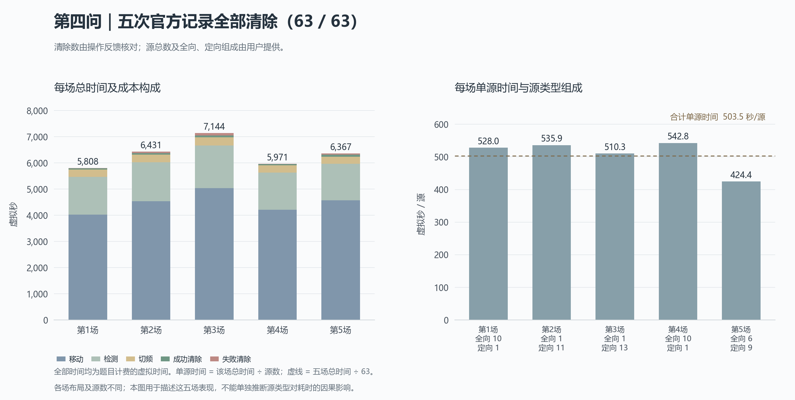

# 第四问五次官方记录分析

这是一组可靠性表现较好的实际验证结果：五场共63个源全部清除，包含全向源占绝大多数和定向源占绝大多数的情况，合并单源虚拟时间为503.51秒。当前 `shared` 版本应保留为后续比较的稳定基线。现有证据支持其能够处理题目的混合源任务，但尚不足以判断性能竞争力；用户提出约400秒的参考后，进一步提速的目标与结构性瓶颈见第6节。

## 1. 材料与统计口径

材料为用户提供的 `测试结果(2).zip`，含01至05五组客户端请求反馈与定位轨迹。官方总源数及全向/定向构成由用户补充，顺序与文件编号对应。文件均以 `practice-q4` 命名，本报告按官方演练记录整理，不代填正式测试编号。

| 场次 | 全向/定向 | 实际成功清除/总数 | 整局虚拟时间（秒） | 单源虚拟时间（秒） | 失败清除次数 |
|---|---:|---:|---:|---:|---:|
| 01 | 10/1 | 11/11 | 5807.97 | 528.00 | 3 |
| 02 | 1/11 | 12/12 | 6430.89 | 535.91 | 18 |
| 03 | 1/13 | 14/14 | 7144.29 | 510.31 | 32 |
| 04 | 10/1 | 11/11 | 5971.31 | 542.85 | 3 |
| 05 | 6/9 | 15/15 | 6366.58 | 424.44 | 18 |

总计全向28源、定向35源，63/63清除。五场总时间31721.050912秒，平均整局6344.21秒。

- 合并单源时间：\(\sum T_i/\sum N_i=503.51\)秒/源。
- 先逐局求单源时间、再对五局取平均：\(\frac15\sum T_i/N_i=508.30\)秒/源。

两者回答不同统计问题，不混用。单局最低424.44、最高542.85秒/源，未出现明显失控的长尾场次。五场仍是五场实验，不能把同场共享扫描路线的63个源当作63次独立成功试验。

## 2. 与本地验证对照

原24组留出条件中，当前方案平均整局6848.07秒、合并单源559.03秒。此次官方记录分别为6344.21秒、503.51秒，比本地相应指标低7.36%和9.93%。

这表明本批官方结果没有暴露明显的性能落差。两批位置分布、源数和类型构成不同，不能把这些差异写成新的算法优化收益。此前31.12%的降幅依然只来自本地同条件、两版本的配对比较；本批没有同一官方布局上的旧版本结果。

第二、三场有11/12和13/14的源为定向源，仍然全清，单源时间分别535.91和510.31秒。它们支持定向处理具有实际可用性。第五场单源时间最好，但源数也最多，能够分摊较固定的覆盖与查漏成本；不能仅依据这五场认定某种类型比例更容易。

## 3. 时间主要花在哪里

根据每条请求的实际移动坐标、接收机频道和成功反馈独立重算：

\[
T=L/5+5N_{\mathrm{测量}}+N_{\mathrm{切频}}+5N_{\mathrm{清除成功}}+3N_{\mathrm{清除失败}}.
\]

| 费用项 | 五場合计（秒） | 占总时间 |
|---|---:|---:|
| 移动 | 22379.05 | 70.55% |
| 检测 | 7390.00 | 23.30% |
| 切频 | 1415.00 | 4.46% |
| 成功清除 | 315.00 | 0.99% |
| 失败清除 | 222.00 | 0.70% |

五场共有1478次检测、1415次切频、63次成功清除、74次失败清除。失败均出现在预先安排的光学覆盖搜索中，26次具有单点几何保证的清除全部成功。失败清除的直接3秒费用很小，优化价值要连同相关移动及获得信息的作用一起衡量。

**覆盖扫描是下一步最值得研究的部分。** 五场均走完25个扫描站，1358次测量用于扫描，占测量次数91.88%。最终判定无源的37个频道，各测了25次，共925次，占全部测量62.58%。这说明现有方案在这批数据中仍承担较固定的全域查漏开销。

按动作理由归类，扫描及抵达扫描点的移动、检测、切频共23202.52秒，占总时间73.15%。这里包含清除点到扫描点的接驳，不能解释为一条独立扫描路线的纯成本；它也与上表按费用项的分类交叉，不能再相加。

| 场次 | 最后一次清除之后的查漏时间（秒） |
|---|---:|
| 01 | 706.49 |
| 02 | 1094.86 |
| 03 | 147.24 |
| 04 | 1653.16 |
| 05 | 763.23 |

平均尾段873.00秒，合计占总时间13.76%。这是事后诊断：程序当时不知道真实总数，不能因为现在已知全部清除，就断言这段路可以直接删去。合理优化必须保留可靠的停止证据。

停点信息复用也确实发生了：92次附加测量获得72次有信号反馈，花费552秒检测与切频时间，没有额外移动。另有28次主动转移测量，其中24次收到信号。这支持两种操作在实际任务中发挥了作用；没有同局取消该操作的对照，不能直接推算各自节省多少总时间。

## 4. 核查结果及一次数值复现差异

五场日志中的11项源码指纹均与当前发布文件一致，未发现客户端错误、拒绝响应或重复的已接受请求。实际成功清除频道数分别与用户给出的总数吻合，退出请求均被接受。

重算1615个动作的计时，与官方累计虚拟时间最大差约\(6.46\times10^{-6}\)秒，符合官方微秒累计与本地未舍入距离求和之间的量级差异。没有发现漏计切频、失败清除或错误更改接收机频道。

独立几何核查覆盖1332份三角形无源证据、37份完整光学覆盖计划和26份单点清除保证，并检查了183次定位区域记录。由于材料没有真实源位置、朝向和探测半径，不能像自建环境那样直接检验每一步定位区域是否包含真值；实际成功反馈、覆盖证明与观测重建是这里的证据。

离线重新运行当前策略，仅在请求动作与记录吻合时提供保存的反馈：

- 01、02、04、05四场的全部动作、轨迹和完成证书严格复现。
- 03场前216个动作一致，第217个动作在一条开放路线与其反向路线之间出现方向分歧。两条路线使用完全相同的任务点；双精度求和得到的长度分别为12847.471320158369和12847.471320158370米，相差约\(1.82\times10^{-12}\)米。
- 该位置两端到起点的距离本就几乎相等。独立检查发现，普通求和与更精确的补偿求和会颠倒末位排序，因此浮点舍入是充分合理的解释；无法仅凭日志确定原运行环境的唯一具体成因。
- 第二次离线核查仅对这处长度差小于\(10^{-8}\)米的逆序路线沿用日志方向，其余决策仍重新计算，之后全部动作、轨迹与完成证书一致。这属于按已记录等价路线进行的核查，**不算第五场严格确定性复现**。

近乎相等的是当前规划的开放路线距离评分。不同方向可能改变后续发现、反馈与重新规划，因此不能进一步声称两个方向的最终整局时间也相同。

上述差异没有推翻清除成功或覆盖证据，但暴露了一个复现性问题：路线评分的最终排序没有对几乎相等的长度统一处理。可以在后续单独版本中增加有明确容差和固定编号规则的并列处理，并做新的本地验证。本轮仅分析记录，未修改冻结求解器，也未将新方向强行接入官方反馈来估算性能。

日志中的本地会话墙钟耗时为5.58至6.95秒，平均6.16秒；这与上面的数千秒虚拟时间是不同量。接口未提供官方汇总表的程序运行时间，仍需从模拟器结果补充。

## 5. 建模评价与下一步

从建模比赛角度，当前方案的优点比较明确：覆盖与停止有可解释的几何依据，定向源的阴影没有被错误当作第三问的半径排除信息；性能改进主要落在题目占比最大的移动成本上；实际记录也支持完整清除与正常运行。现阶段更适合把它保留为稳定主方案，并整理正式论文中的推导、实验和边界。

若继续研究，按优先顺序考虑：

1. **覆盖证书与行走路线共同优化。** 研究是否可以利用已到达的定位点、只覆盖真实圆域内的区域、按剩余未认证区域安排扫描，从而减少固定25站的开销。需要保持对未知朝向和最小1000米半径的保证，不能直接减少扫描点。
2. **为近等长路线提供稳定选择规则。** 这是本批发现的具体复现性问题，适合小范围修正后单独验证，不应包装为已证实的时间收益。
3. **进一步利用阴影反馈约束。** 类型、方向和半径的联合可行集仍有研究价值，但当前五场没有显示需要立即推翻局部定位模型，优先级低于覆盖与移动问题。

不建议依据这五局公布的真实源数或类型比例设置提前停止规则，也不建议仅为了减少失败清除次数而增做大量测向。任何新候选都应先做本地独立验证，再与稳定版比较；这五局已经看过，应视作诊断资料，不再充当独立留出数据。

原始文件保存在项目 `local_data/q4_official_20260911_batch2`，由Git忽略；[去身份化分析结果](../results/official_q4_20260911_analysis.json)保存逐局费用、核查状态和数值分歧记录。分析程序为[analyze_official_results.py](../code/analyze_official_results.py)，只读保存反馈并进行离线计算，不连接模拟器。此次压缩包不含官方结果表、真实位置或官方加密行为日志，尚不能据此补齐题目要求的正式测试材料。

## 6. 以400秒为目标重新评估

用户补充看到其他方案约400秒的结果，但尚不清楚问题、清除比例、源数和平均口径。因此将400秒/源作为进一步研究的目标，不据此声称已经核实与他人存在同条件差距。“能够全清”与“性能已经足够有竞争力”需要分别判断；前五节的全清证据不等于可以结束提速研究。

对本批63源，503.51降至400秒/源意味着总时间再减少20.56%，五场共需减少6521.05秒，平均每场1304.21秒。这是结构性改进的量级。

一个有约束条件的下界可以帮助选择方向：目前25站从原点出发的最小生成树长18005.665306米，而已找到的开放扫描路径达到同一数值，因而在数值精度内达到该固定站点集合的行走下界。若仍走完25站并保留本批检测、切频、清除次数，即使所有行走都压到这条纯扫描路线、没有额外定位接驳，合并时间也仍为434.09秒/源。这个下界只适用于上述固定结构，不适用于所有可能的第四问模型。

另外，即使事后删去全部末次清除后的查漏时间，也只是434.22秒/源，而且程序当时不知道真实总数，不能直接这样停止。仅删除全部失败清除的直接费用，则仍为499.98秒/源。因此，冲击400应同时研究覆盖结构、检测分配及定位与扫描的联合路线，单纯缩短尾段或减少失败次数不足以支撑该目标。定量记录见[target400_assessment.json](../results/target400_assessment.json)。

当前覆盖证明要求同一组证据站同时接近整块大三角形，这是充分条件，可能比真实点态接收条件保守。真实条件可以写为：对每个目标位置 \(g\)，\(g\) 位于其1000米内测站的凸包中，从而任意朝向的闭半平面都能遇到一个可接收测站。采用更细的局部证书，有机会改变固定25站结构。

已开展的少站探测中，21站的一组粗筛结果在密筛时被184个漏检点否定，具体反例予以保留；另一22站构造获得108个细胞的完整覆盖证书，并通过精确有理数的独立剖分、距离和凸包核查，见[几何探索归档](../../04_22站覆盖实验/results/coverage_probe_400/README.md)。这里的成果是静态覆盖可行性，尚未接入整局求解器或获得新时间成绩。22站当前找到的从原点出发的扫描路线长17891.88米，仅比原25站最短路线少113.78米，也说明站点数减少不能直接换算为同比例的行走收益。

后续应以覆盖证书、站点布局和实际整局时间共同选择候选，并在新的本地布局上保留全清与计时审计。当前生产求解器保持原版本，本轮未连接官方模拟器，也未声称已经达到400秒。
