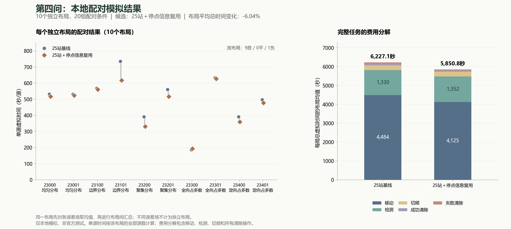

# 第四问：覆盖、任务重排与停点信息复用实验

2026年9月11日。全部实验在本地完成，未连接或启动官方模拟器。

后续更新（9月12日）：已为本报告选出的share25另建[独立演练入口](第四问share25候选演练说明.md)，补充本地接口验证；原默认入口和本报告的算法、指标保持不变。下文“本轮”指9月11日模型实验。

交接补注（2026-09-12）：share25此后已取得[第六批4场官方演练](../../03_官方演练与时间诊断/reports/官方演练第六批share25结果分析.md)，51/51全清、平均整局6594.44秒，尚未证实官方提速。下文“尚无新官方成绩”“未提交”等仅保留9月11日实验阶段状态，不能作为当前判断。最新[share25_prune候选](25站保序删点候选运行说明.md)已有本地接入验证及第八批5场官方演练（72/72全清）；其旧轨迹受限重算不改变本文share25的本地配对结果。

**本轮找到一个有独立验证收益的候选 `share25`：保留25站覆盖，每次主动测向后重排剩余任务，并在源服务停点复用已有位置测量其他已知源。** 在未参与选择的10个布局、20组配对条件中，平均总时间下降6.04%，18组更快、2组更慢；两版均全清。另30组压力条件全部通过。它适合作为下一轮演练候选，尚无新官方成绩；现有官方入口仍运行已有五次演练证据的 `joint_solver/shared`。

## 1. 模型上改变了什么

原方案把一个已知源的定位与清除连续做完，然后重新规划剩余任务；也只在固定扫描停点复用位置测量其他已知源。原方案每次测量后也会更新信息、重算局部动作，但仍继续优先服务同一源，没有重新比较其他源与扫描任务。

新候选作两项调整：

1. 每次主动测量后更新观测信息，有方向或近距离反馈时更新位置可行域，再重新安排所有剩余扫描和源任务。无信号反馈只记录为负观测，不直接缩减保守位置可行域。每源累计最多6次专门定位的主动测量（共享测量另计），随后仍有完整光学覆盖作为后备。
2. 在主动测量或完整源服务结束的位置，按原来的收益评分挑选最多两个其他已知源测量。已有测量点过近（80米以内）时跳过；只有预测局部后续费用下降时才测量。可靠的20米范围内顺手清除也沿用原规则。

这里的收益评分可写成“当前预计清除费用 − 新测量与测量后预计清除费用”。新增测量实际支付5秒，实际换频另付1秒；第二次共享测量前重新计算换频费用。位置已经到达只能省移动，不能把检测视为免费。

这些调整对应题目的移动、检测和清除时间目标，没有使用真实源数、类型、位置或朝向作决策。求解器只访问公开位置、当前频道及实际测量/清除反馈。停止条件、保守位置可行域、完整光学覆盖、25站连续覆盖证明均沿用原方案。

仍须承认：有限位置与朝向情景、局部收益评分、最小包围圆路线代理、两次共享上限及80米间隔都是启发式。局部预计收益不等于全局路线收益，本轮没有证明全局最优。

## 2. 22站与其他方向的结果

本轮也将已证明的22站布局接入了完整求解器。实际接收站与几何证明的细分顶点分开：22个接收站构成108个证明细胞。对每个细胞C选取见证测站W，使C包含在W的凸包内，且每个见证站到C的每个顶点距离均不超过1000米。由凸性可得，对C内任何源位置和任何180度定向朝向，至少一个见证站可见。

[精确几何审计](../../04_22站覆盖实验/results/coverage_probe_400/independent-exact-audit-22-990.json)验证了外接域、细胞分割、距离与凸包关系；实现保留精确中点关系，实际无源证书仅引用真实负反馈。几何可行不等于时间更优：已知22站静态路线相对25站只短约114米，而且测站改变会同时影响首次发现、测向质量与清除路线。

第一批开发采用5个布局，每版均全清并通过独立审计：

| 候选 | 相对25站原版平均总时间下降 | 更快 / 更慢条件 | 判断 |
|---|---:|---:|---|
| 22站，原局部策略 `cells` | 1.79% | 2 / 3 | 收益不稳定 |
| 22站，计入后续路程 `context` | 4.35% | 2 / 3 | 大部分净收益来自一个16源聚集布局 |
| 再逐次重排 `interleave` | 3.95% | 2 / 3 | 没有进一步改善该批均值 |
| 再尝试额外查漏 `opscan` | 3.95% | 2 / 3 | 本批机会扫描未触发，不能声称有贡献 |

这一批 `context` 的本地合并均值虽然是389.43秒/源，但原版本在同批也只有407.12秒/源，且它属于开发数据。不能把这个数当成官方已达到400秒。

此外，[更少外环站点的8,224组规则布局筛查](../../04_22站覆盖实验/results/compact_cover_screening/README.md)均未通过必要检查，并记录了有明显数值裕量的真实漏检反例。这只否定受检布局，不证明更少站点不可行。

## 3. 开发选择与冻结

第二批改用5个新布局，保持各版布局与误差场相同，独立比较覆盖与任务策略：

| 版本 | 平均整局时间（秒） | 相对原版下降 | 更快 / 更慢 |
|---|---:|---:|---:|
| 25站原版 `baseline25` | 6404.46 | — | — |
| 22站后续路程 `context` | 6327.03 | 1.21% | 3 / 2 |
| 25站逐次重排 `resume25` | 6129.13 | 4.30% | 5 / 0 |
| 25站停点复用 `share25` | 5956.85 | 6.99% | 5 / 0 |

按照提前写入的[评价计划](../results/cell_evaluation_plan.json)，选择第二批全清且审计通过候选中均值最低的 `share25`，在运行留出数据前保存[代码冻结指纹](../results/cell_selection.json)。两批共45次正式开发运行，均不并入留出结果。额外冒烟复查也不当作独立布局。

## 4. 新布局验证

五类布局各2个：均匀、边界、聚集、全向占多数、定向占多数；各布局分别采用固定空间散列误差场和接近误差端点的固定误差场，共20组条件、10个独立布局。源数由生成器产生，范围10至16；求解器不读取这些真值。同一布局的两个误差场只算重复条件，不能当成两个独立布局。

| 指标 | 25站原版 | share25候选 |
|---|---:|---:|
| 平均整局虚拟时间 | 6227.13秒 | 5850.85秒 |
| 合并单源时间：总时间之和 / 总源数 | 482.72秒 | 453.55秒 |
| 各局单源时间的算术平均 | 502.37秒 | 472.13秒 |
| 全清、独立审计通过 | 20 / 20 | 20 / 20 |
| 成功清除源实例 | 258 / 258 | 258 / 258 |

平均每局节省376.29秒，下降6.04%；20组条件18胜2负。先对同布局的两个误差场平均，再比较10个布局，是9胜1负。最差条件为一个16源、全向占多数的布局：3092.17升至3377.28秒，多285.11秒，退步9.22%。逐一删除一个布局后重新计算，平均下降范围为4.55%至6.69%；这是敏感性描述，不是置信区间。

| 布局类型 | 平均整局时间下降 | 更快 / 更慢条件 |
|---|---:|---:|
| 均匀 | 2.19% | 4 / 0 |
| 边界 | 8.96% | 4 / 0 |
| 聚集 | 11.58% | 4 / 0 |
| 全向占多数 | -0.64% | 2 / 2 |
| 定向占多数 | 6.01% | 4 / 0 |

五类布局的比例是本地实验设计，不代表官方案例分布，也不构成官方成绩或排名推断。



## 5. 时间为什么下降

以下为同一20组条件的平均每局费用变化，全部基于真实执行动作：

| 费用 | 候选相对原版变化 |
|---|---:|
| 移动 | 减少359.59秒，约1797.94米 |
| 检测 | 增加22.75秒 |
| 切频 | 增加5.25秒 |
| 失败清除 | 减少44.70秒 |
| 成功清除 | 不变 |
| 合计 | 减少376.29秒 |

平均每局停点共享测量从10.80次增至20.25次，专门主动测量从10.40次降至5.45次。新增的信息改善了后续定位和路线，移动与失败清除的节省超过了额外检测、切频费用。由于行为相互影响，不能把这些差额当作各模块互不相关的固定收益。

## 6. 正确性与使用边界

候选另通过[30组压力条件](../results/task_stress_share25/summary.json)：10个构造布局分别施加固定+1度、-1度和交错端点误差，共372源实例全部清除。包括边界外向/切向最小半径、网格接缝、5米/20米阈值、近共线、近重合、极端类型配比与最大半径角度接缝。独立审计检查10,057次动作、1085个位置可行域、219个完整光学计划和6912项三角覆盖证据。

压力布局是针对性检查，不能并入性能均值。留出与压力合计50组条件、630源实例通过，但仍不是任意场景成功的实证保证。原覆盖与后备证明的适用前提仍是题目的固定半径、180度定向区域、误差界、反馈及费用规则。

留出候选的实测求解耗时平均8.83秒、最大17.63秒；压力最大13.42秒。两批曾在同一台电脑并行运行，这些现实耗时含资源竞争，且不含独立审计，不用于精确性能比较或代填官方程序运行时间。

候选达到了预先写入的工程筛选条件：均值至少下降5%、10个布局至少6个更快、最差条件退步不超过15%，以及留出/压力全部全清并通过审计。这些门槛是本次选择规则，不是统计显著性标准。[最终评价记录](../results/task_candidate_assessment.json)核对了冻结、留出和压力运行的源码指纹一致。

**结论：本轮选择 `share25` 作为下一轮演练候选，保留22站等负结果作为研究材料。尚未达到可以宣称官方400秒的证据水平。** 当前根目录“运行第四问”仍启动原版；本候选没有在本轮接入官方入口或运行新的HTTP接口检查。新代码与实验仅保存本地，未提交或推送GitHub。

## 7. 文件与本地复现

- [候选求解器](../../task_sharing_solver.py)：`solve_multi(public_api, variant='share25', trace=trace)`。
- [第二批开发分析](../results/task_development_22000/analysis.json)、[留出分析](../results/task_holdout_23000/analysis.json)：保留逐场来源、动作、真值和证明，分析脚本另行核对费用与配对关系。
- [22站求解器](../../04_22站覆盖实验/code/cell_solver.py)、[几何实现](../../04_22站覆盖实验/code/cell_cover.py)、[独立审计适配](../../04_22站覆盖实验/code/cell_validation.py)、[后续费用策略](../../04_22站覆盖实验/code/context_policy.py)：独立研究代码，不改变原版依赖。
- [实验驱动](../code/benchmark_task_sharing.py)、[压力驱动](../code/stress_task_sharing.py)、[分析脚本](../../04_22站覆盖实验/code/analyze_cell_experiment.py)、[最终评价](../code/assess_task_candidate.py)。

在项目根目录运行以下命令可复现留出记录；输出目录必须尚不存在。相同种子复现属于核验，不是新增独立样本。

```powershell
python -X utf8 tools/run_study.py q4_share --script benchmark_task_sharing.py -- --out src/q4_model/05_候选share25/results/my-share25-check --start-seed 23000 --layouts 2 --fields hash,extreme --variants baseline25,share25
python -X utf8 tools/run_study.py q4_cells --script analyze_cell_experiment.py -- --directory src/q4_model/05_候选share25/results/my-share25-check
python -X utf8 tools/run_study.py q4_share --script stress_task_sharing.py -- --variant share25 --out src/q4_model/05_候选share25/results/my-share25-stress
```
